# Introdução

Informações básicas do projeto.

* **Projeto:** D.O.S.E - Dashboard de Operações e Sistema de Estoque
* **Repositório GitHub:** [[LINK PARA O REPOSITÓRIO NO GITHUB](https://github.com/ICEI-PUC-Minas-PPLES-TI/plf-es-2026-1-ti1-7620100-alunos-da-d-o-s-e-2.git)]
* **Membros da equipe:**

  * [Beatriz Carvalho Ferreira](https://github.com/beatrizf777)
  * [Igor Costa Carvalho Campos Silva](https://github.com/igorrCarvalho) 
  * [Isadora Ferreira Alvarenga](https://github.com/isadoraalvarenga)
  * [Maria Eduarda Madeira Santana](https://github.com/MariaEMadeira)
  * [Samuel Ferreira Gil](https://github.com/SamuelfGil)

A documentação do projeto é estruturada da seguinte forma:

1. Introdução
2. Contexto
3. Product Discovery
4. Product Design (**A entrega da fase de Concepção finaliza aqui**)
5. Metodologia
6. Solução
7. Referências Bibliográficas

✅ [Documentação de Design Thinking (MIRO)](img/dthinking.png)

# Contexto

Gestão de estoque ineficiente e desorganizada, resultando em diversos problemas operacionais, como a presença de medicamentos vencidos e a indisponibilidade de itens que, segundo o sistema, ainda estariam em estoque. Essa falha compromete o controle, gera desperdícios e pode impactar diretamente a qualidade do atendimento, e gerar risco à vida. Com isso, temos como o objetivo do projeto, melhorar a gestão do estoque de pequenas farmácias, evitando esses empecilhos acima citados.

## Problema

O grande problema identificado são as consequências geradas pela falta de um gerenciamento de estoque prático e que realmente funcione no dia a dia, visto que, além de falta de organização e perda de lucro, um medicamento vencido administrado a um paciente ou a falta dele pode acarretar no falecimento de um ser humano, bem como no fechamento do estabelecimento, levando em consideração que em média 84% da farmácias brasileiras são microempresas.    

## Objetivos
### Objetivo Geral

A D.O.S.E  tem como principal objetivo solucionar problemas no ramo logístico farmacêutico, tendo como foco a gestão e aprimoramento de estoques, visando a o equilíbrio e crescimento da saúde no país além da manutenção e crescimento da economia visto que 84% das farmácias brasileiras são micro farmácias e maior parte delas fecham devido a mal gerenciamento do estoque.

---

### Objetivos Específicos

* Melhorar o controle de entradas e saídas de produtos  
* Reduzir erros no gerenciamento de estoque  
* Auxiliar na tomada de decisões com base em dados  
* Diminuir perdas e falta de medicamentos  

## Justificativa

A gestão ineficiente de estoque é uma das principais causas de prejuízo em pequenos estabelecimentos farmacêuticos. Diferente de grandes redes, farmácias independentes raramente dispõem de sistemas robustos e integrados, ficando vulneráveis a erros humanos e à falta de visibilidade sobre seu próprio inventário. Uma solução acessível, simples e direcionada a esse perfil de negócio tem potencial direto de impacto na saúde financeira do estabelecimento e na qualidade do atendimento prestado à população. E é nesse cenário que surge a DOSE, criando um sistema totalmente voltado para esse contexto, visando as pessoas incluídas nesse problema no dia a dia, desenvolvendo uma plataforma otimizada e simples, para o melhor uso desses usuários.

## Público-Alvo

Gestores/proprietários de pequenas farmácias, responsáveis pelas decisões estratégicas como compras com fornecedores, análise de estoque e controle financeiro.
Colaboradores/atendentes, que usam o sistema no dia a dia para registrar entradas e saídas de produtos, precisando de uma interface simples e rápida.
Clientes da farmácia, como a Adriana, que são impactados indiretamente pela qualidade da gestão do estoque — esperando encontrar os produtos que precisam disponíveis no momento da compra.

# Product Discovery

## Etapa de Entendimento

* Pesquisa e entendimento do problema:

>
> * **Matriz CSD**: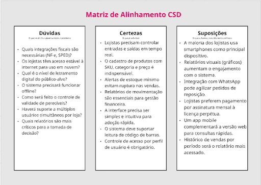
> * **Mapa de stakeholders**: 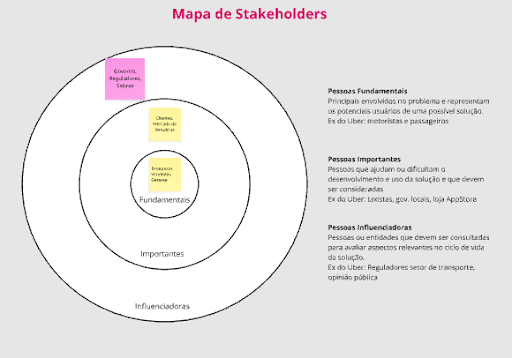
> * **Entrevistas qualitativas**: série de entrevistas qualitativas para validar suposições e solucionar as dúvidas com as principais pessoas envolvidas;
> * **Highlights de pesquisa**: um compilado do levantamento realizado por meio das entrevistas.

## Etapa de Definição

### Personas

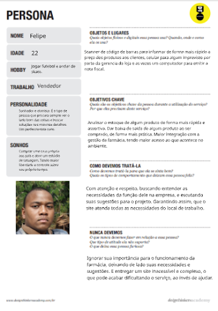

# Product Design

## Histórias de Usuários

## Proposta de Valor

##### Proposta de valor para Persona Adriana
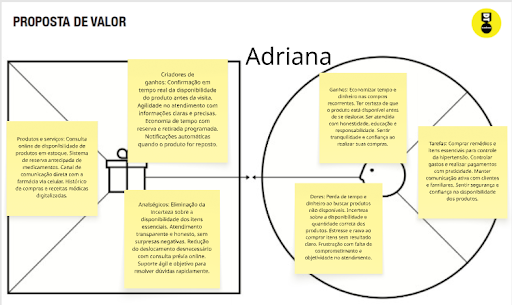

##### Proposta de valor para Persona Carolina

##### Proposta de valor para Persona Felipe
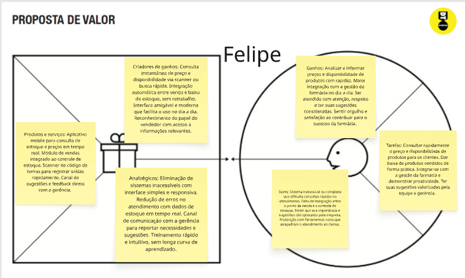

##### Proposta de valor para Persona Carlos

## Projeto de Interface

Fluxo do usuário: O quadro abaixo pode ser acessado de forma interativa:

[Quadro no Miro](https://miro.com/app/board/uXjVGzLfF8I=/)

### Wireframes

##### TELA HOME cliente

Essas duas telas representam uma visão do cliente no sistema

### User Flow

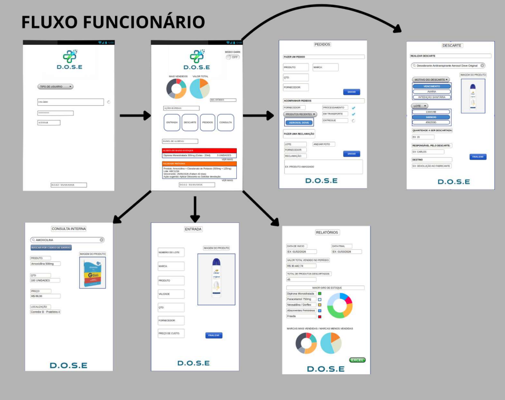
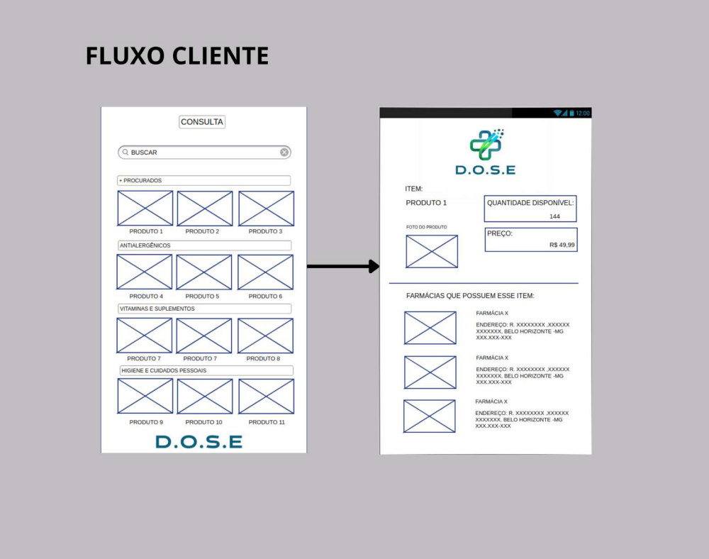

### Protótipo Interativo

Protótipo Interativo:
[Quadro no Miro](https://marvelapp.com/prototype/11hf6ide/screen/98666031)

# Metodologia

O desenvolvimento do projeto utiliza a metodologia **Scrum**, baseada em ciclos curtos de desenvolvimento (Sprints), permitindo entregas contínuas e evolução constante do sistema.

## Ferramentas

Relação de ferramentas empregadas pelo grupo durante o projeto.

| Ambiente                    | Plataforma | Link de acesso                                     |
| --------------------------- | ---------- | -------------------------------------------------- |
| Processo de Design Thinking | Miro       | https://miro.com/app/board/uXjVGzLfF8I=/        |
| Repositório de código     | GitHub     | https://github.com/ICEI-PUC-Minas-PPLES-TI/plf-es-2026-1-ti1-7620100-alunos-da-d-o-s-e-2.git     |
| Hospedagem do site          | Render     | https://plf-es-2026-1-ti1-7620100-dose-production.up.railway.app/modulos/login/login.html|
| Protótipo Interativo       | MarvelApp  | https://marvelapp.com/prototype/11hf6ide/screen/98666031  |
|                             |            |                                                    |

| Gestão do Projeto (Kanban) | Trello       | https://trello.com/invite/b/64b73fb99972d88cf43d4e4d/ATTIaf5ee966d5b4ba3d2bc80372624d0e3a3C60B2B5/stakeholders        |
| Protótipo Interativo     | Pencil Project     | https://pencil.evolus.vn/      |
| Protótipo Interativo          | Justinmind     | https://www.justinmind.com/ |
| Comunicação e Reuniões       | WhatsApp / Discord  | https://www.whatsapp.com/    &     https://discord.com/   |
|                             |            |                                                    |

> Ferramentas Empregadas

A execução deste projeto utilizou ferramentas voltadas para a construção de wireframes e para a organização da comunicação entre os membros:

Pencil Project e Justinmind: Ambas as ferramentas foram utilizadas para a elaboração dos wireframes do projeto. A escolha de utilizar duas plataformas distintas ocorreu pela necessidade de divisão de trabalho entre os integrantes; enquanto um membro desenvolvia uma parte do layout no Pencil Project, outro utilizava o Justinmind para construir as demais telas, garantindo a integridade e a entrega do projeto final.

WhatsApp: Utilizado como o canal principal de comunicação para alinhamentos rápidos, decisões de grupo e coordenação de prazos.

Discord: Empregado para a realização de reuniões pontuais com o uso do recurso de compartilhamento de tela, permitindo que os membros visualizassem e ajustassem o design em conjunto e em tempo real.

Trello: Ferramenta utilizada para a implementação do quadro de tarefas (Kanban), permitindo o monitoramento visual do progresso do trabalho.

## Gerenciamento do Projeto

Divisão de papéis no grupo e apresentação da estrutura da ferramenta de controle de tarefas (Kanban).
Durante o desenvolvimento são realizadas atividades como:

- levantamento de requisitos;
- planejamento das funcionalidades;
- desenvolvimento incremental;
- testes das funcionalidades;
- validação com a equipe;
- documentação do projeto.

Organização da Equipe e Processo de Trabalho: 

O grupo estruturou seu processo de trabalho utilizando metodologias ágeis e o framework Scrum, adaptando as práticas para o ambiente acadêmico com foco na colaboração direta. A equipe realizou encontros presenciais na unidade da PUC Minas (Praça da Liberdade) após o horário das aulas para a definição de escopo e distribuição de tarefas.

Divisão de Papéis:

Gestão e Prototipagem: O desenvolvimento ocorreu de forma paralela, com membros trabalhando simultaneamente em diferentes partes da interface. Enquanto um integrante trabalhava na estrutura base utilizando o Pencil Project, o outro utilizava o Justinmind para desenvolver as demais telas, garantindo fluidez e agilidade.

Gestão de Configuração (GitHub): A responsabilidade pelo repositório foi concentrada em um dos membros da equipe, que cuidou da organização geral e do envio dos arquivos. Um segundo integrante colaborou em uma parcela menor desta etapa, auxiliando na configuração de partes específicas do repositório para assegurar o versionamento correto de toda a documentação.

Processo de Design Thinking:
O desenvolvimento seguiu as etapas de Design Thinking para garantir que o painel atendesse às necessidades dos usuários. Durante os encontros presenciais, o grupo realizou as fases de Imersão e Ideação para discutir o escopo e funcionalidades. A fase de Prototipação transformou essas ideias em representações visuais através das ferramentas de diagramação escolhidas.

Quadro de Controle de Tarefas (Kanban)
Para o monitoramento do status de desenvolvimento em tempo real, utilizou-se a ferramenta Trello. A estrutura do quadro foi organizada para permitir o controle visual do fluxo de trabalho:

Para fazer: Atividades pendentes, como a entrega final no portal Canvas, documentação completa e organização do repositório no GitHub.

Em progresso: Tarefas em execução, como o aperfeiçoamento dos slides e revisão da metodologia.

Feitas: Etapas concluídas, incluindo o planejamento inicial, definição de escopo e a criação dos wireframes no Pencil Project e Justinmind.

Abaixo, apresenta-se a captura de tela do quadro preenchido, evidenciando o acompanhamento das tarefas e a evolução do cronograma:

# Solução Implementada

O **D.O.S.E.** oferece uma solução completa para o gerenciamento de estoque em farmácias, centralizando todas as informações em um único sistema.

Entre seus principais recursos destacam-se:

- gerenciamento completo do estoque;
- cadastro e edição de produtos;
- controle de preços;
- registro de descartes;
- localização dos produtos dentro da farmácia;
- integração entre unidades da rede;
- consulta da farmácia mais próxima com determinado medicamento disponível;
- dashboards com gráficos para acompanhamento do estoque e das operações.

Com essas funcionalidades, o sistema proporciona maior organização, redução de perdas, aumento da produtividade dos funcionários e apoio à tomada de decisões gerenciais.

## Vídeo do Projeto

O vídeo a seguir traz uma apresentação do problema que a equipe está tratando e a proposta de solução. ⚠️ EXEMPLO ⚠️

## Funcionalidades

Esta seção apresenta as funcionalidades da solução.

* **Tela da funcionalidade**:

##### Funcionalidade 1 - Login
O usuário inicia o processo na tela de login, onde informa seu login e senha para acessar sua conta.

Caso ainda não possua cadastro, pode selecionar "Cadastre-se" para criar uma nova conta.

Também existe a opção "Ver farmácias sem entrar", permitindo visualizar as farmácias disponíveis sem necessidade de autenticação.

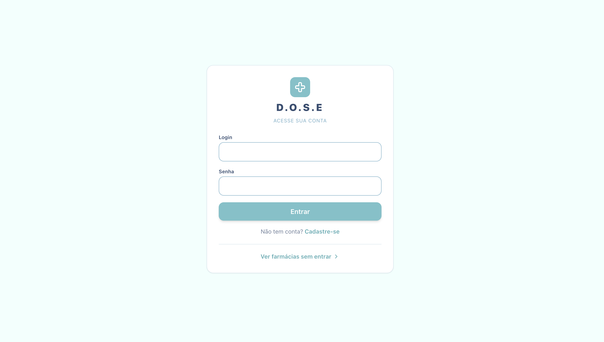

##### Funcionalidade 2. Página inicial da Área do Cliente

Após realizar o login, o usuário é direcionado para a área do cliente.

Nesta tela é possível:

visualizar seus endereços cadastrados;
acessar o mapa das farmácias;
pesquisar produtos;
consultar disponibilidade de medicamentos;
acessar avaliações;
realizar logout.

O menu lateral facilita a navegação entre as funcionalidades.

##### Funcionalidade 3 - Cadastro de Endereço
Ao clicar em "Adicionar Endereço", é exibido um formulário contendo:

Apelido do endereço;
Rua;
Número;
Bairro;
Cidade;
Estado.

Após preencher os campos, o usuário salva o endereço, que poderá ser utilizado para calcular a distância até as farmácias cadastradas.

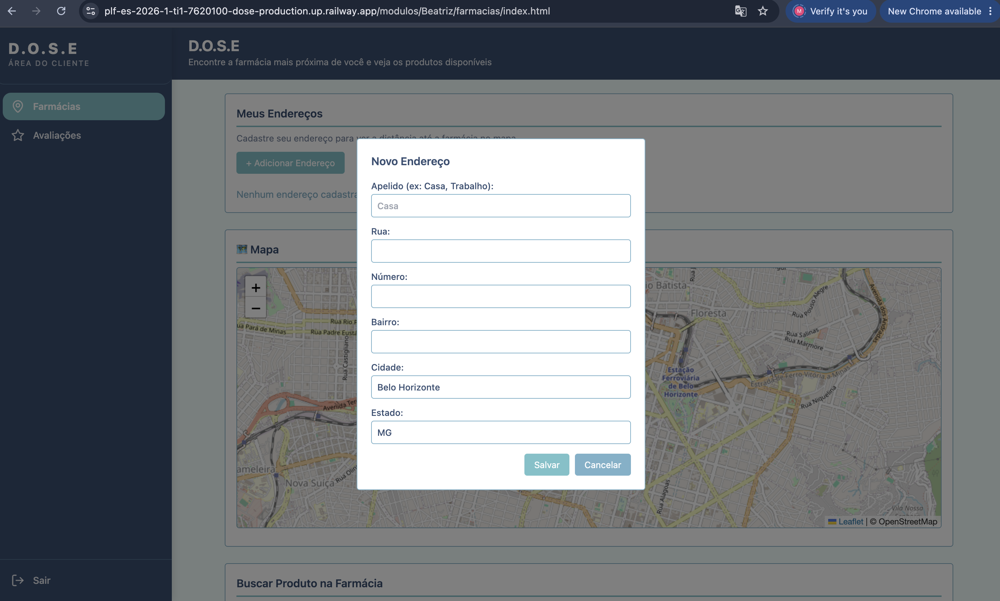

##### Funcionalidade 4 - Visualização do mapa
O sistema apresenta um mapa interativo utilizando Leaflet e OpenStreetMap.

O mapa permite visualizar a localização das farmácias cadastradas e servir como referência para identificação da unidade mais próxima do endereço informado pelo cliente.
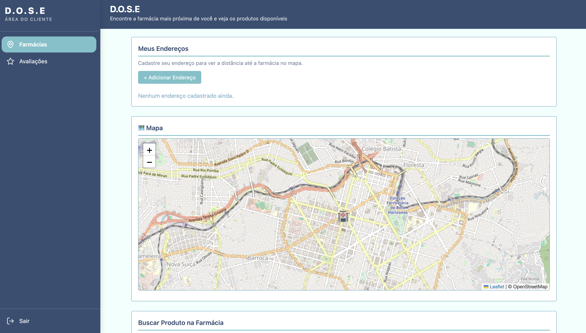

##### Funcionalidade 5 - Busca de produtos

Na seção Buscar Produto na Farmácia, o usuário pode realizar pesquisas utilizando filtros como:

categoria;
produto;
nome do medicamento.

Após selecionar os critérios desejados, basta clicar em Buscar.
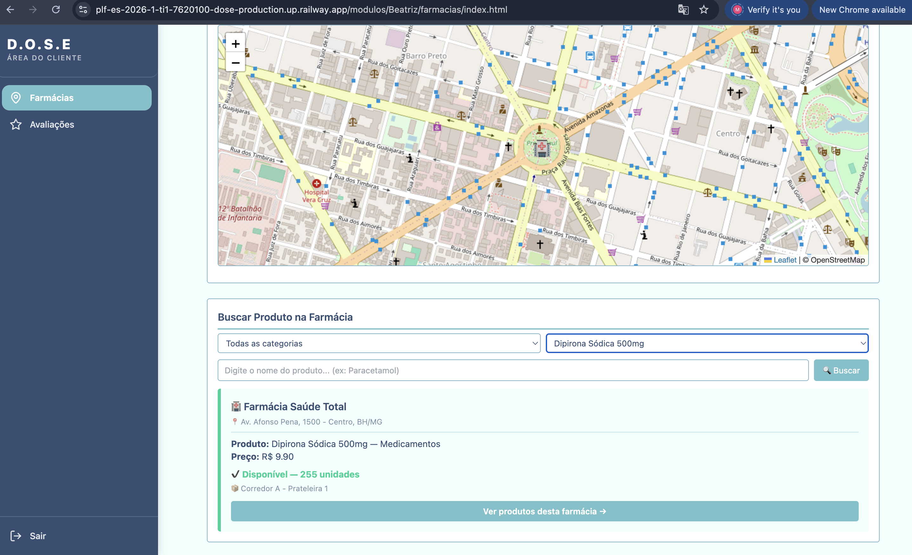

##### Funcionalidade 6 - Resultado da pesquisa
Após a pesquisa, o sistema apresenta as farmácias que possuem o medicamento solicitado.

Para cada resultado são exibidas informações como:

nome da farmácia;
endereço;
produto encontrado;
categoria;
preço;
quantidade disponível em estoque;
localização do produto dentro da farmácia (corredor e prateleira).

Essas informações permitem ao cliente comparar opções e localizar rapidamente o medicamento desejado.

##### Funcionalidade 7 - Consulta ao estoque da farmácia

Ao selecionar "Ver produtos desta farmácia", o usuário pode visualizar os demais medicamentos disponíveis naquela unidade, facilitando a busca por produtos relacionados ou complementares.
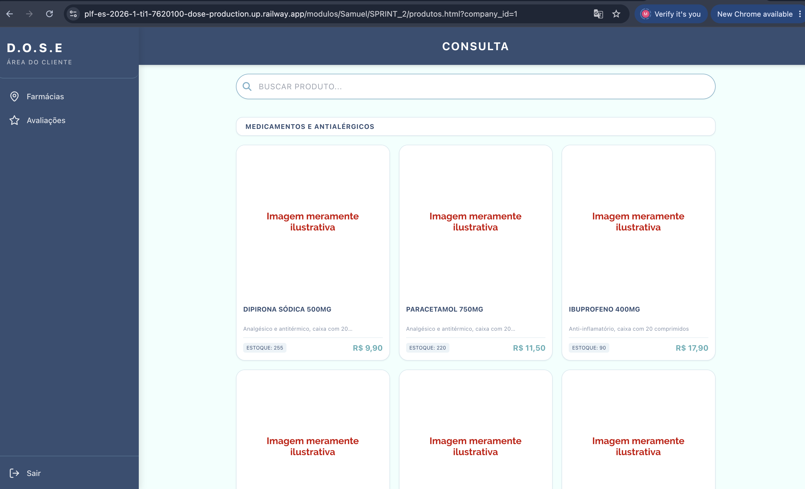

##### Funcionalidade 8 - Avaliações

Por meio da opção Avaliações, o cliente pode consultar ou registrar avaliações referentes às farmácias, contribuindo para a melhoria do serviço e auxiliando outros usuários na escolha da unidade.
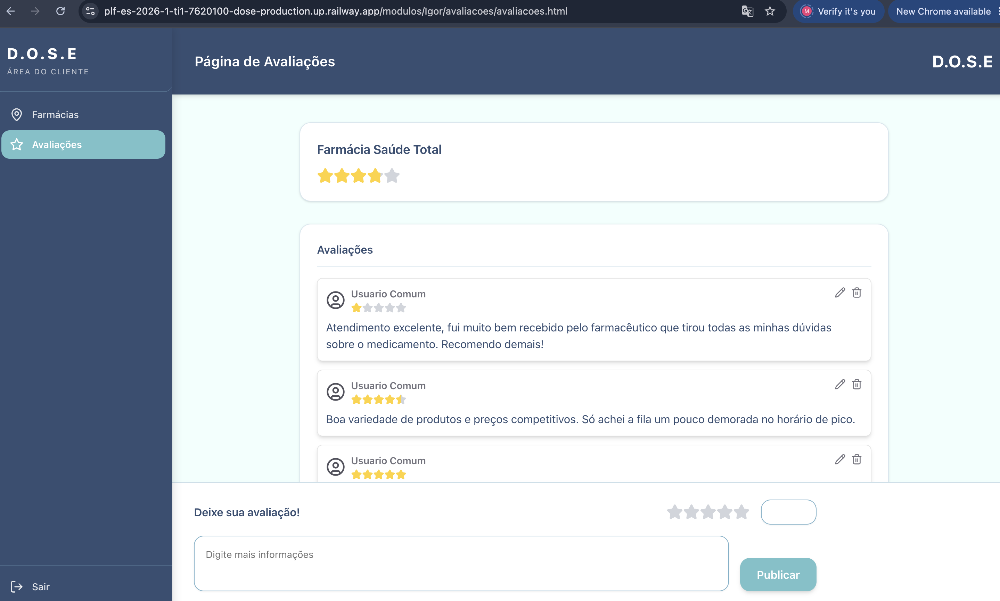

## Estruturas de Dados

Descrição das estruturas de dados utilizadas na solução com exemplos no formato JSON.Info

##### Estrutura de Dados - {
  "companies": [
    {
      "id": 1,
      "name": "Farmácia Saúde Total",
      "created_at": "2024-01-15T10:00:00Z",
      "updated_at": "2025-03-10T14:22:00Z",
      "email": "contato@saudetotal.com.br",
      "document": "12.345.678/0001-90",
      "status": "ACTIVE",
      "phone": "(31) 3333-4444",
      "address": "Av. Afonso Pena, 1500 - Centro, Belo Horizonte/MG",
      "sales_representative": "Ricardo Mendes",
      "rating": 3.81,
      "invite_key": "FST-9X7Q2K4M"
    }
  ],
  "carriers": [
    {
      "id": 1,
      "name": "Transportadora Rápida Ltda",
      "created_at": "2024-02-01T09:00:00Z",
      "updated_at": "2024-12-01T11:30:00Z",
      "email": "comercial@transrapida.com.br",
      "document": "23.456.789/0001-01",
      "status": "ACTIVE",
      "phone": "(31) 3222-1111",
      "address": "Rua dos Caminhoneiros, 200 - Industrial, Contagem/MG",
      "website": "https://transrapida.com.br",
      "sales_representative": "Paulo Souza"
    },
    {
      "id": 2,
      "name": "LogMed Transportes",
      "created_at": "2024-02-15T09:30:00Z",
      "updated_at": "2025-01-20T16:00:00Z",
      "email": "vendas@logmed.com.br",
      "document": "34.567.890/0001-12",
      "status": "ACTIVE",
      "phone": "(31) 3444-5555",
      "address": "Av. das Indústrias, 800 - Cidade Industrial, BH/MG",
      "website": "https://logmed.com.br",
      "sales_representative": "Fernanda Lima"
    },
    {
      "id": 3,
      "name": "Expresso Farma",
      "created_at": "2024-05-10T08:00:00Z",
      "updated_at": "2025-02-12T10:15:00Z",
      "email": "atendimento@expressofarma.com",
      "document": "45.678.901/0001-23",
      "status": "ACTIVE",
      "phone": "(31) 3777-8888",
      "address": "Rod. Fernão Dias, KM 480 - Vespasiano/MG",
      "website": "https://expressofarma.com",
      "sales_representative": "Carlos Andrade"
    }
  ],
  "manufacturers": [
    {
      "id": 1,
      "name": "EMS S/A",
      "created_at": "2024-01-20T10:00:00Z",
      "updated_at": "2025-01-10T14:00:00Z",
      "email": "atendimento@ems.com.br",
      "document": "57.507.378/0003-65",
      "status": "ACTIVE",
      "phone": "(19) 3887-9999",
      "address": "Rod. Jornalista F. A. de Almeida, KM 138 - Hortolândia/SP",
      "website": "https://ems.com.br",
      "sales_representative": "Mariana Costa"
    },
    {
      "id": 2,
      "name": "Eurofarma Laboratórios",
      "created_at": "2024-01-20T10:15:00Z",
      "updated_at": "2025-01-15T11:00:00Z",
      "email": "sac@eurofarma.com.br",
      "document": "61.190.096/0001-92",
      "status": "ACTIVE",
      "phone": "(11) 5908-5000",
      "address": "Av. Vereador José Diniz, 3465 - Campo Belo, São Paulo/SP",
      "website": "https://eurofarma.com.br",
      "sales_representative": "Bruno Oliveira"
    },
    {
      "id": 3,
      "name": "Medley Farmacêutica",
      "created_at": "2024-02-05T11:00:00Z",
      "updated_at": "2025-02-01T09:30:00Z",
      "email": "contato@medley.com.br",
      "document": "10.588.595/0010-92",
      "status": "ACTIVE",
      "phone": "(19) 3887-8800",
      "address": "Rua Macedo Costa, 55 - Campinas/SP",
      "website": "https://medley.com.br",
      "sales_representative": "Juliana Reis"
    },
    {
      "id": 4,
      "name": "Johnson & Johnson do Brasil",
      "created_at": "2024-03-01T10:00:00Z",
      "updated_at": "2025-02-20T15:45:00Z",
      "email": "consumidor@its.jnj.com",
      "document": "59.748.988/0001-14",
      "status": "ACTIVE",
      "phone": "(11) 3030-3000",
      "address": "Av. Presidente Juscelino Kubitschek, 2041 - São Paulo/SP",
      "website": "https://jnjbrasil.com.br",
      "sales_representative": "André Pereira"
    },
    {
      "id": 5,
      "name": "Sanofi Medley Farmacêutica",
      "created_at": "2024-03-15T10:00:00Z",
      "updated_at": "2025-04-10T14:00:00Z",
      "email": "sac@sanofi.com.br",
      "document": "82.657.131/0001-69",
      "status": "ACTIVE",
      "phone": "(11) 4502-7000",
      "address": "Av. Major Sylvio de Magalhães Padilha, 5200 - São Paulo/SP",
      "website": "https://sanofi.com.br",
      "sales_representative": "Patrícia Almeida"
    },
    {
      "id": 6,
      "name": "Bayer S.A.",
      "created_at": "2024-04-01T10:00:00Z",
      "updated_at": "2025-04-15T11:30:00Z",
      "email": "consumidor@bayer.com",
      "document": "18.459.628/0001-15",
      "status": "ACTIVE",
      "phone": "(11) 5694-5000",
      "address": "Rua Domingos Jorge, 1100 - Socorro, São Paulo/SP",
      "website": "https://bayer.com.br",
      "sales_representative": "Roberto Nakamura"
    },
    {
      "id": 7,
      "name": "Aché Laboratórios Farmacêuticos",
      "created_at": "2024-05-10T09:00:00Z",
      "updated_at": "2025-05-01T10:00:00Z",
      "email": "sac@ache.com.br",
      "document": "60.659.463/0029-92",
      "status": "ACTIVE",
      "phone": "(11) 4654-4000",
      "address": "Rod. Pres. Dutra, KM 222,2 - Guarulhos/SP",
      "website": "https://ache.com.br",
      "sales_representative": "Camila Tavares"
    },
    {
      "id": 8,
      "name": "Beiersdorf do Brasil",
      "created_at": "2024-06-05T10:00:00Z",
      "updated_at": "2025-04-20T11:00:00Z",
      "email": "atendimento@beiersdorf.com.br",
      "document": "44.734.671/0001-51",
      "status": "ACTIVE",
      "phone": "(11) 3030-4000",
      "address": "Av. das Nações Unidas, 14.401 - São Paulo/SP",
      "website": "https://beiersdorf.com.br",
      "sales_representative": "Mariana Schmidt"
    },
    {
      "id": 9,
      "name": "Colgate-Palmolive Industrial Ltda",
      "created_at": "2024-06-20T09:00:00Z",
      "updated_at": "2025-05-05T14:00:00Z",
      "email": "atendimento@colpal.com",
      "document": "60.398.138/0001-77",
      "status": "ACTIVE",
      "phone": "(11) 5564-7000",
      "address": "Av. Marginal do Rio Pinheiros, 5200 - Osasco/SP",
      "website": "https://colgate.com.br",
      "sales_representative": "Felipe Vasconcelos"
    },
    {
      "id": 10,
      "name": "Procter & Gamble do Brasil",
      "created_at": "2024-07-15T10:00:00Z",
      "updated_at": "2025-04-25T16:00:00Z",
      "email": "consumidor@pg.com",
      "document": "59.981.713/0001-08",
      "status": "ACTIVE",
      "phone": "(11) 3030-5000",
      "address": "Av. Dr. Chucri Zaidan, 1240 - São Paulo/SP",
      "website": "https://br.pg.com",
      "sales_representative": "Renata Pacheco"
    }
  ],
  "brands": [
    {
      "id": 1,
      "name": "EMS",
      "created_at": "2024-01-20T10:30:00Z",
      "updated_at": "2025-01-10T14:30:00Z",
      "email": "marca@ems.com.br",
      "document": "57.507.378/0003-65",
      "status": "ACTIVE",
      "phone": "(19) 3887-9999",
      "address": "Hortolândia/SP",
      "website": "https://ems.com.br",
      "sales_representative": "Mariana Costa"
    },
    {
      "id": 2,
      "name": "Eurofarma",
      "created_at": "2024-01-20T10:45:00Z",
      "updated_at": "2025-01-15T11:15:00Z",
      "email": "marca@eurofarma.com.br",
      "document": "61.190.096/0001-92",
      "status": "ACTIVE",
      "phone": "(11) 5908-5000",
      "address": "São Paulo/SP",
      "website": "https://eurofarma.com.br",
      "sales_representative": "Bruno Oliveira"
    },
    {
      "id": 3,
      "name": "Medley",
      "created_at": "2024-02-05T11:15:00Z",
      "updated_at": "2025-02-01T09:45:00Z",
      "email": "marca@medley.com.br",
      "document": "10.588.595/0010-92",
      "status": "ACTIVE",
      "phone": "(19) 3887-8800",
      "address": "Campinas/SP",
      "website": "https://medley.com.br",
      "sales_representative": "Juliana Reis"
    },
    {
      "id": 4,
      "name": "Neutrogena",
      "created_at": "2024-03-01T10:30:00Z",
      "updated_at": "2025-02-20T16:00:00Z",
      "email": "marca@neutrogena.com",
      "document": "59.748.988/0001-14",
      "status": "ACTIVE",
      "phone": "(11) 3030-3000",
      "address": "São Paulo/SP",
      "website": "https://neutrogena.com.br",
      "sales_representative": "André Pereira"
    },
    {
      "id": 5,
      "name": "Johnson's",
      "created_at": "2024-03-01T10:45:00Z",
      "updated_at": "2025-02-20T16:15:00Z",
      "email": "marca.johnsons@its.jnj.com",
      "document": "59.748.988/0001-14",
      "status": "ACTIVE",
      "phone": "(11) 3030-3000",
      "address": "São Paulo/SP",
      "website": "https://johnsonsbaby.com.br",
      "sales_representative": "André Pereira"
    },
    {
      "id": 6,
      "name": "Genérico EMS",
      "created_at": "2024-04-10T09:00:00Z",
      "updated_at": "2025-01-30T13:00:00Z",
      "email": "generico@ems.com.br",
      "document": "57.507.378/0003-65",
      "status": "ACTIVE",
      "phone": "(19) 3887-9999",
      "address": "Hortolândia/SP",
      "website": "https://ems.com.br",
      "sales_representative": "Mariana Costa"
    },
    {
      "id": 7,
      "name": "Sanofi",
      "created_at": "2024-03-15T10:30:00Z",
      "updated_at": "2025-04-10T14:15:00Z",
      "email": "marca@sanofi.com.br",
      "document": "82.657.131/0001-69",
      "status": "ACTIVE",
      "phone": "(11) 4502-7000",
      "address": "São Paulo/SP",
      "website": "https://sanofi.com.br",
      "sales_representative": "Patrícia Almeida"
    },
    {
      "id": 8,
      "name": "Bayer",
      "created_at": "2024-04-01T10:30:00Z",
      "updated_at": "2025-04-15T11:45:00Z",
      "email": "marca@bayer.com",
      "document": "18.459.628/0001-15",
      "status": "ACTIVE",
      "phone": "(11) 5694-5000",
      "address": "São Paulo/SP",
      "website": "https://bayer.com.br",
      "sales_representative": "Roberto Nakamura"
    },
    {
      "id": 9,
      "name": "Aché",
      "created_at": "2024-05-10T09:30:00Z",
      "updated_at": "2025-05-01T10:15:00Z",
      "email": "marca@ache.com.br",
      "document": "60.659.463/0029-92",
      "status": "ACTIVE",
      "phone": "(11) 4654-4000",
      "address": "Guarulhos/SP",
      "website": "https://ache.com.br",
      "sales_representative": "Camila Tavares"
    },
    {
      "id": 10,
      "name": "Nivea",
      "created_at": "2024-06-05T10:00:00Z",
      "updated_at": "2025-04-20T11:00:00Z",
      "email": "marca@nivea.com.br",
      "document": "27.345.678/0001-12",
      "status": "ACTIVE",
      "phone": "(11) 3030-4000",
      "address": "São Paulo/SP",
      "website": "https://nivea.com.br",
      "sales_representative": "Mariana Schmidt"
    },
    {
      "id": 11,
      "name": "Colgate",
      "created_at": "2024-06-20T09:00:00Z",
      "updated_at": "2025-05-05T14:00:00Z",
      "email": "marca@colgate.com.br",
      "document": "47.512.456/0001-78",
      "status": "ACTIVE",
      "phone": "(11) 5564-7000",
      "address": "Osasco/SP",
      "website": "https://colgate.com.br",
      "sales_representative": "Felipe Vasconcelos"
    },
    {
      "id": 12,
      "name": "Vick",
      "created_at": "2024-07-15T10:00:00Z",
      "updated_at": "2025-04-25T16:00:00Z",
      "email": "marca@vick.com.br",
      "document": "33.789.123/0001-45",
      "status": "ACTIVE",
      "phone": "(11) 3030-5000",
      "address": "São Paulo/SP",
      "website": "https://vicksvaporub.com.br",
      "sales_representative": "Renata Pacheco"
    }
  ],
  "usuarios": [
    {
      "id": 1,
      "login": "admin",
      "senha": "123",
      "nome": "Administrador do Sistema",
      "email": "admin@abc.com",
      "is_worker": true,
      "role": "Gerente",
      "company_id": 1
    },
    {
      "id": 2,
      "login": "user",
      "senha": "123",
      "nome": "Usuario Comum",
      "email": "user@abc.com",
      "is_worker": true,
      "role": "Atendente",
      "company_id": 1
    },
    {
      "login": "rommel",
      "senha": "123",
      "nome": "Rommel",
      "email": "rommel@gmail.com",
      "id": 3,
      "is_worker": true,
      "role": "Atendente",
      "company_id": 1
    },
    {
      "login": "Samuel",
      "senha": "123",
      "nome": "Samuel Gil",
      "email": "samuel@gmail.com",
      "id": 4,
      "is_worker": true,
      "role": "Atendente",
      "company_id": 1
    },
    {
      "login": "andre009",
      "senha": "123456",
      "nome": "André Carneiro",
      "email": "andre@email.com",
      "is_worker": true,
      "role": "Gerente",
      "company_id": 1,
      "id": 5
    },
    {
      "login": "andre009",
      "senha": "123456",
      "nome": "André Carneiro",
      "email": "andre@email.com",
      "is_worker": true,
      "role": "Gerente",
      "company_id": 1,
      "id": 6
    },
    {
      "login": "iguu",
      "senha": "123456",
      "nome": "iguu",
      "email": "iguu@email.com",
      "is_worker": false,
      "role": null,
      "company_id": null,
      "id": 7
    }
  ],
  "categories": [
    {
      "id": 1,
      "company_id": 1,
      "name": "Medicamentos",
      "created_at": "2024-01-16T09:00:00Z",
      "updated_at": "2024-01-16T09:00:00Z",
      "status": "ACTIVE"
    },
    {
      "id": 2,
      "company_id": 1,
      "name": "Higiene Pessoal",
      "created_at": "2024-01-16T09:05:00Z",
      "updated_at": "2024-01-16T09:05:00Z",
      "status": "ACTIVE"
    },
    {
      "id": 3,
      "company_id": 1,
      "name": "Cosméticos",
      "created_at": "2024-01-16T09:10:00Z",
      "updated_at": "2024-01-16T09:10:00Z",
      "status": "ACTIVE"
    },
    {
      "id": 4,
      "company_id": 1,
      "name": "Suplementos",
      "created_at": "2024-01-16T09:15:00Z",
      "updated_at": "2024-01-16T09:15:00Z",
      "status": "ACTIVE"
    },
    {
      "id": 5,
      "company_id": 1,
      "name": "Primeiros Socorros",
      "created_at": "2024-01-16T09:20:00Z",
      "updated_at": "2024-01-16T09:20:00Z",
      "status": "ACTIVE"
    }
  ],
  "products": [
    {
      "id": 1,
      "company_id": 1,
      "category_id": 1,
      "brand_id": 1,
      "name": "Dipirona Sódica 500mg",
      "description": "Analgésico e antitérmico, caixa com 20 comprimidos",
      "cost": 4.5,
      "price": 9.9,
      "sku": "MED-DIP-500-20",
      "upc": "7891317012340",
      "created_at": "2024-02-10T10:00:00Z",
      "updated_at": "2025-01-15T14:00:00Z",
      "deleted_at": null,
      "location": "Corredor A - Prateleira 1",
      "image_url": "https://placehold.co/600x600/ffffff/cc0000?text=Imagem+meramente%0Ailustrativa&font=raleway"
    },
    {
      "id": 2,
      "company_id": 1,
      "category_id": 1,
      "brand_id": 2,
      "name": "Paracetamol 750mg",
      "description": "Analgésico e antitérmico, caixa com 20 comprimidos",
      "cost": 5.2,
      "price": 11.5,
      "sku": "MED-PAR-750-20",
      "upc": "7896004701234",
      "created_at": "2024-02-10T10:05:00Z",
      "updated_at": "2025-01-15T14:05:00Z",
      "deleted_at": null,
      "location": "Corredor A - Prateleira 1",
      "image_url": "https://placehold.co/600x600/ffffff/cc0000?text=Imagem+meramente%0Ailustrativa&font=raleway"
    },
    {
      "id": 3,
      "company_id": 1,
      "category_id": 1,
      "brand_id": 3,
      "name": "Ibuprofeno 400mg",
      "description": "Anti-inflamatório, caixa com 20 comprimidos",
      "cost": 8,
      "price": 17.9,
      "sku": "MED-IBU-400-20",
      "upc": "7896658045678",
      "created_at": "2024-02-10T10:10:00Z",
      "updated_at": "2025-01-15T14:10:00Z",
      "deleted_at": null,
      "location": "Corredor A - Prateleira 2",
      "image_url": "https://placehold.co/600x600/ffffff/cc0000?text=Imagem+meramente%0Ailustrativa&font=raleway"
    },
    {
      "id": 4,
      "company_id": 1,
      "category_id": 1,
      "brand_id": 6,
      "name": "Omeprazol 20mg",
      "description": "Protetor gástrico, caixa com 28 cápsulas",
      "cost": 12,
      "price": 26.5,
      "sku": "MED-OME-20-28",
      "upc": "7891317098765",
      "created_at": "2024-02-12T10:00:00Z",
      "updated_at": "2025-02-01T11:00:00Z",
      "deleted_at": null,
      "location": "Corredor A - Prateleira 3",
      "image_url": "https://placehold.co/600x600/ffffff/cc0000?text=Imagem+meramente%0Ailustrativa&font=raleway"
    },
    {
      "id": 5,
      "company_id": 1,
      "category_id": 1,
      "brand_id": 1,
      "name": "Amoxicilina 500mg",
      "description": "Antibiótico, caixa com 21 cápsulas",
      "cost": 18.5,
      "price": 39.9,
      "sku": "MED-AMO-500-21",
      "upc": "7891317023456",
      "created_at": "2024-02-15T10:00:00Z",
      "updated_at": "2025-02-10T13:00:00Z",
      "deleted_at": null,
      "location": "Corredor B - Geladeira 1",
      "image_url": "https://placehold.co/600x600/ffffff/cc0000?text=Imagem+meramente%0Ailustrativa&font=raleway"
    },
    {
      "id": 6,
      "company_id": 1,
      "category_id": 2,
      "brand_id": 5,
      "name": "Shampoo Johnson's Baby 200ml",
      "description": "Shampoo infantil hipoalergênico",
      "cost": 9.8,
      "price": 19.9,
      "sku": "HIG-SHA-JNJ-200",
      "upc": "7891010234567",
      "created_at": "2024-03-05T10:00:00Z",
      "updated_at": "2025-02-20T16:30:00Z",
      "deleted_at": null,
      "location": "Corredor C - Prateleira 1",
      "image_url": "https://placehold.co/600x600/ffffff/cc0000?text=Imagem+meramente%0Ailustrativa&font=raleway"
    },
    {
      "id": 7,
      "company_id": 1,
      "category_id": 2,
      "brand_id": 4,
      "name": "Sabonete Neutrogena Facial 80g",
      "description": "Sabonete facial para pele oleosa",
      "cost": 11.5,
      "price": 24.9,
      "sku": "HIG-SAB-NEU-80",
      "upc": "7891010345678",
      "created_at": "2024-03-05T10:10:00Z",
      "updated_at": "2025-02-20T16:35:00Z",
      "deleted_at": null,
      "location": "Corredor C - Prateleira 2",
      "image_url": "https://placehold.co/600x600/ffffff/cc0000?text=Imagem+meramente%0Ailustrativa&font=raleway"
    },
    {
      "id": 8,
      "company_id": 1,
      "category_id": 3,
      "brand_id": 4,
      "name": "Protetor Solar Neutrogena FPS 50",
      "description": "Protetor solar facial 60ml",
      "cost": 32,
      "price": 59.9,
      "sku": "COS-PRO-NEU-60",
      "upc": "7891010456789",
      "created_at": "2024-04-01T11:00:00Z",
      "updated_at": "2025-03-01T10:00:00Z",
      "deleted_at": null,
      "location": "Corredor D - Prateleira 1",
      "image_url": "https://placehold.co/600x600/ffffff/cc0000?text=Imagem+meramente%0Ailustrativa&font=raleway"
    },
    {
      "id": 9,
      "company_id": 1,
      "category_id": 4,
      "brand_id": 1,
      "name": "Vitamina C 1g",
      "description": "Suplemento vitamínico, 30 comprimidos efervescentes",
      "cost": 14,
      "price": 29.9,
      "sku": "SUP-VTC-1G-30",
      "upc": "7891317056789",
      "created_at": "2024-04-15T09:00:00Z",
      "updated_at": "2025-02-25T14:00:00Z",
      "deleted_at": null,
      "location": "Corredor E - Prateleira 1",
      "image_url": "https://placehold.co/600x600/ffffff/cc0000?text=Imagem+meramente%0Ailustrativa&font=raleway"
    },
    {
      "id": 10,
      "company_id": 1,
      "category_id": 4,
      "brand_id": 2,
      "name": "Polivitamínico Centrum 60 cps",
      "description": "Multivitamínico completo",
      "cost": 38,
      "price": 79.9,
      "sku": "SUP-CEN-MULT-60",
      "upc": "7896004012345",
      "created_at": "2024-04-15T09:10:00Z",
      "updated_at": "2025-02-25T14:10:00Z",
      "deleted_at": null,
      "location": "Corredor E - Prateleira 2",
      "image_url": "https://placehold.co/600x600/ffffff/cc0000?text=Imagem+meramente%0Ailustrativa&font=raleway"
    },
    {
      "id": 11,
      "company_id": 1,
      "category_id": 5,
      "brand_id": 5,
      "name": "Curativo Band-Aid 40 unidades",
      "description": "Curativos adesivos sortidos",
      "cost": 6.5,
      "price": 14.9,
      "sku": "PRI-BAN-JNJ-40",
      "upc": "7891010567890",
      "created_at": "2024-05-01T10:00:00Z",
      "updated_at": "2025-03-05T11:00:00Z",
      "deleted_at": null,
      "location": "Corredor F - Prateleira 1",
      "image_url": "https://placehold.co/600x600/ffffff/cc0000?text=Imagem+meramente%0Ailustrativa&font=raleway"
    },
    {
      "id": 12,
      "company_id": 1,
      "category_id": 5,
      "brand_id": 3,
      "name": "Álcool em Gel 70% 250ml",
      "description": "Antisséptico para as mãos",
      "cost": 4.2,
      "price": 9.9,
      "sku": "PRI-ALG-70-250",
      "upc": "7896658123456",
      "created_at": "2024-05-01T10:10:00Z",
      "updated_at": "2025-03-05T11:10:00Z",
      "deleted_at": null,
      "location": "Corredor F - Prateleira 2",
      "image_url": "https://placehold.co/600x600/ffffff/cc0000?text=Imagem+meramente%0Ailustrativa&font=raleway"
    },
    {
      "id": 13,
      "company_id": 1,
      "category_id": 1,
      "brand_id": 9,
      "name": "Loratadina 10mg",
      "description": "Antialérgico, caixa com 12 comprimidos",
      "cost": 7.2,
      "price": 16.9,
      "sku": "MED-LOR-10-12",
      "upc": "7896658067890",
      "created_at": "2024-05-12T10:00:00Z",
      "updated_at": "2025-03-20T14:00:00Z",
      "deleted_at": null,
      "location": "Corredor A - Prateleira 4",
      "image_url": "https://placehold.co/600x600/ffffff/cc0000?text=Imagem+meramente%0Ailustrativa&font=raleway"
    },
    {
      "id": 14,
      "company_id": 1,
      "category_id": 1,
      "brand_id": 8,
      "name": "Aspirina 500mg",
      "description": "Analgésico e antitérmico, caixa com 30 comprimidos",
      "cost": 6,
      "price": 13.9,
      "sku": "MED-ASP-500-30",
      "upc": "7891058034567",
      "created_at": "2024-04-10T10:00:00Z",
      "updated_at": "2025-03-15T11:00:00Z",
      "deleted_at": null,
      "location": "Corredor A - Prateleira 5",
      "image_url": "https://placehold.co/600x600/ffffff/cc0000?text=Imagem+meramente%0Ailustrativa&font=raleway"
    },
    {
      "id": 15,
      "company_id": 1,
      "category_id": 1,
      "brand_id": 7,
      "name": "Dorflex",
      "description": "Relaxante muscular, caixa com 36 comprimidos",
      "cost": 8.5,
      "price": 18.9,
      "sku": "MED-DOR-36",
      "upc": "7891058045678",
      "created_at": "2024-04-20T10:00:00Z",
      "updated_at": "2025-03-18T11:30:00Z",
      "deleted_at": null,
      "location": "Corredor A - Prateleira 6",
      "image_url": "https://placehold.co/600x600/ffffff/cc0000?text=Imagem+meramente%0Ailustrativa&font=raleway"
    },
    {
      "id": 16,
      "company_id": 1,
      "category_id": 1,
      "brand_id": 12,
      "name": "Vick VapoRub 50g",
      "description": "Pomada descongestionante para alívio de sintomas de resfriado",
      "cost": 13.5,
      "price": 28.9,
      "sku": "MED-VIC-VAP-50",
      "upc": "7891058056789",
      "created_at": "2024-07-15T10:30:00Z",
      "updated_at": "2025-04-01T12:00:00Z",
      "deleted_at": null,
      "location": "Corredor A - Prateleira 7",
      "image_url": "https://placehold.co/600x600/ffffff/cc0000?text=Imagem+meramente%0Ailustrativa&font=raleway"
    },
    {
      "id": 17,
      "company_id": 1,
      "category_id": 1,
      "brand_id": 2,
      "name": "Cetoprofeno 100mg",
      "description": "Anti-inflamatório, caixa com 10 comprimidos",
      "cost": 14,
      "price": 29.9,
      "sku": "MED-CET-100-10",
      "upc": "7896004078901",
      "created_at": "2024-08-01T09:00:00Z",
      "updated_at": "2025-04-05T13:00:00Z",
      "deleted_at": null,
      "location": "Corredor A - Prateleira 8",
      "image_url": "https://placehold.co/600x600/ffffff/cc0000?text=Imagem+meramente%0Ailustrativa&font=raleway"
    },
    {
      "id": 18,
      "company_id": 1,
      "category_id": 2,
      "brand_id": 11,
      "name": "Creme Dental Colgate Total 12 90g",
      "description": "Creme dental com proteção 12 horas",
      "cost": 5.8,
      "price": 12.9,
      "sku": "HIG-COL-TOT-90",
      "upc": "7891024034567",
      "created_at": "2024-06-25T10:00:00Z",
      "updated_at": "2025-04-12T15:00:00Z",
      "deleted_at": null,
      "location": "Corredor C - Prateleira 3",
      "image_url": "https://placehold.co/600x600/ffffff/cc0000?text=Imagem+meramente%0Ailustrativa&font=raleway"
    },
    {
      "id": 19,
      "company_id": 1,
      "category_id": 2,
      "brand_id": 10,
      "name": "Desodorante Nivea Roll-on 50ml",
      "description": "Antitranspirante 48h",
      "cost": 7,
      "price": 15.9,
      "sku": "HIG-NIV-ROL-50",
      "upc": "7891024045678",
      "created_at": "2024-06-10T10:00:00Z",
      "updated_at": "2025-04-10T15:30:00Z",
      "deleted_at": null,
      "location": "Corredor C - Prateleira 4",
      "image_url": "https://placehold.co/600x600/ffffff/cc0000?text=Imagem+meramente%0Ailustrativa&font=raleway"
    },
    {
      "id": 20,
      "company_id": 1,
      "category_id": 3,
      "brand_id": 10,
      "name": "Hidratante Nivea Soft 200ml",
      "description": "Hidratante corporal multi-uso",
      "cost": 11,
      "price": 24.9,
      "sku": "COS-NIV-SOF-200",
      "upc": "7891024056789",
      "created_at": "2024-06-12T10:00:00Z",
      "updated_at": "2025-04-15T16:00:00Z",
      "deleted_at": null,
      "location": "Corredor D - Prateleira 2",
      "image_url": "https://placehold.co/600x600/ffffff/cc0000?text=Imagem+meramente%0Ailustrativa&font=raleway"
    },
    {
      "id": 21,
      "company_id": 1,
      "category_id": 4,
      "brand_id": 1,
      "name": "Ômega 3 1000mg 60 cápsulas",
      "description": "Suplemento de ácidos graxos",
      "cost": 18,
      "price": 39.9,
      "sku": "SUP-OMG-1G-60",
      "upc": "7891317067890",
      "created_at": "2024-05-20T09:00:00Z",
      "updated_at": "2025-03-10T14:00:00Z",
      "deleted_at": null,
      "location": "Corredor E - Prateleira 3",
      "image_url": "https://placehold.co/600x600/ffffff/cc0000?text=Imagem+meramente%0Ailustrativa&font=raleway"
    },
    {
      "id": 22,
      "company_id": 1,
      "category_id": 5,
      "brand_id": 5,
      "name": "Termômetro Digital",
      "description": "Termômetro digital clínico com display LCD",
      "cost": 22,
      "price": 49.9,
      "sku": "PRI-TER-DIG-01",
      "upc": "7891010678901",
      "created_at": "2024-09-01T10:00:00Z",
      "updated_at": "2025-04-20T11:00:00Z",
      "deleted_at": null,
      "location": "Corredor F - Prateleira 3",
      "image_url": "https://placehold.co/600x600/ffffff/cc0000?text=Imagem+meramente%0Ailustrativa&font=raleway"
    }
  ],
  "batches": [
    {
      "id": 1,
      "carrier_id": 1,
      "product_id": 1,
      "manufacturer_id": 1,
      "valid_until": "2026-08-15",
      "quantity": 150,
      "complaint": null,
      "batch_identifier": "EMS-DIP-2025-001"
    },
    {
      "id": 2,
      "carrier_id": 1,
      "product_id": 1,
      "manufacturer_id": 1,
      "valid_until": "2026-12-20",
      "quantity": 80,
      "complaint": null,
      "batch_identifier": "EMS-DIP-2025-014"
    },
    {
      "id": 3,
      "carrier_id": 2,
      "product_id": 2,
      "manufacturer_id": 2,
      "valid_until": "2026-09-30",
      "quantity": 120,
      "complaint": null,
      "batch_identifier": "EUR-PAR-2025-007"
    },
    {
      "id": 4,
      "carrier_id": 2,
      "product_id": 3,
      "manufacturer_id": 3,
      "valid_until": "2027-01-10",
      "quantity": 90,
      "complaint": null,
      "batch_identifier": "MED-IBU-2025-003"
    },
    {
      "id": 5,
      "carrier_id": 1,
      "product_id": 4,
      "manufacturer_id": 1,
      "valid_until": "2026-06-25",
      "quantity": 60,
      "complaint": null,
      "batch_identifier": "EMS-OME-2025-012"
    },
    {
      "id": 6,
      "carrier_id": 3,
      "product_id": 5,
      "manufacturer_id": 1,
      "valid_until": "2025-11-30",
      "quantity": 40,
      "complaint": null,
      "batch_identifier": "EMS-AMO-2024-022"
    },
    {
      "id": 7,
      "carrier_id": 3,
      "product_id": 6,
      "manufacturer_id": 4,
      "valid_until": "2027-03-15",
      "quantity": 100,
      "complaint": null,
      "batch_identifier": "JNJ-SHA-2025-005"
    },
    {
      "id": 8,
      "carrier_id": 3,
      "product_id": 7,
      "manufacturer_id": 4,
      "valid_until": "2026-10-10",
      "quantity": 75,
      "complaint": null,
      "batch_identifier": "JNJ-NEU-2025-008"
    },
    {
      "id": 9,
      "carrier_id": 2,
      "product_id": 8,
      "manufacturer_id": 4,
      "valid_until": "2027-05-20",
      "quantity": 50,
      "complaint": null,
      "batch_identifier": "JNJ-NEU-2025-010"
    },
    {
      "id": 10,
      "carrier_id": 1,
      "product_id": 9,
      "manufacturer_id": 1,
      "valid_until": "2026-07-08",
      "quantity": 110,
      "complaint": null,
      "batch_identifier": "EMS-VTC-2025-009"
    },
    {
      "id": 11,
      "carrier_id": 2,
      "product_id": 10,
      "manufacturer_id": 2,
      "valid_until": "2026-11-22",
      "quantity": 65,
      "complaint": null,
      "batch_identifier": "EUR-CEN-2025-002"
    },
    {
      "id": 12,
      "carrier_id": 3,
      "product_id": 11,
      "manufacturer_id": 4,
      "valid_until": "2028-01-15",
      "quantity": 200,
      "complaint": null,
      "batch_identifier": "JNJ-BAN-2025-011"
    },
    {
      "id": 13,
      "carrier_id": 1,
      "product_id": 12,
      "manufacturer_id": 3,
      "valid_until": "2026-04-30",
      "quantity": 180,
      "complaint": null,
      "batch_identifier": "MED-ALG-2025-006"
    },
    {
      "id": 14,
      "carrier_id": 1,
      "product_id": 1,
      "manufacturer_id": 1,
      "valid_until": "2025-05-01",
      "quantity": 25,
      "complaint": null,
      "batch_identifier": "EMS-DIP-2024-088"
    },
    {
      "id": 15,
      "carrier_id": 2,
      "product_id": 4,
      "manufacturer_id": 1,
      "valid_until": "2025-04-15",
      "quantity": 18,
      "complaint": null,
      "batch_identifier": "EMS-OME-2024-095"
    },
    {
      "id": 16,
      "carrier_id": 2,
      "product_id": 15,
      "manufacturer_id": 5,
      "valid_until": "2027-08-15",
      "quantity": 100,
      "complaint": null,
      "batch_identifier": "SAN-DOR-2026-001"
    },
    {
      "id": 17,
      "carrier_id": 1,
      "product_id": 14,
      "manufacturer_id": 6,
      "valid_until": "2027-09-30",
      "quantity": 150,
      "complaint": null,
      "batch_identifier": "BAY-ASP-2026-001"
    },
    {
      "id": 18,
      "carrier_id": 3,
      "product_id": 13,
      "manufacturer_id": 7,
      "valid_until": "2027-10-20",
      "quantity": 80,
      "complaint": null,
      "batch_identifier": "ACH-LOR-2026-001"
    },
    {
      "id": 19,
      "carrier_id": 2,
      "product_id": 17,
      "manufacturer_id": 2,
      "valid_until": "2027-11-10",
      "quantity": 60,
      "complaint": null,
      "batch_identifier": "EUR-CET-2026-001"
    },
    {
      "id": 20,
      "carrier_id": 2,
      "product_id": 2,
      "manufacturer_id": 2,
      "valid_until": "2027-06-15",
      "quantity": 100,
      "complaint": null,
      "batch_identifier": "EUR-PAR-2026-009"
    },
    {
      "id": 21,
      "carrier_id": 3,
      "product_id": 16,
      "manufacturer_id": 10,
      "valid_until": "2027-06-15",
      "quantity": 45,
      "complaint": null,
      "batch_identifier": "PEG-VIC-2025-002"
    },
    {
      "id": 22,
      "carrier_id": 1,
      "product_id": 18,
      "manufacturer_id": 9,
      "valid_until": "2028-01-30",
      "quantity": 90,
      "complaint": null,
      "batch_identifier": "CPL-COL-2025-005"
    },
    {
      "id": 23,
      "carrier_id": 2,
      "product_id": 19,
      "manufacturer_id": 8,
      "valid_until": "2027-12-20",
      "quantity": 70,
      "complaint": null,
      "batch_identifier": "BSD-NIV-2025-003"
    },
    {
      "id": 24,
      "carrier_id": 2,
      "product_id": 20,
      "manufacturer_id": 8,
      "valid_until": "2027-09-10",
      "quantity": 55,
      "complaint": null,
      "batch_identifier": "BSD-NIV-2025-004"
    },
    {
      "id": 25,
      "carrier_id": 1,
      "product_id": 21,
      "manufacturer_id": 1,
      "valid_until": "2027-04-30",
      "quantity": 50,
      "complaint": null,
      "batch_identifier": "EMS-OMG-2025-013"
    },
    {
      "id": 26,
      "carrier_id": 3,
      "product_id": 22,
      "manufacturer_id": 4,
      "valid_until": "2030-01-01",
      "quantity": 25,
      "complaint": null,
      "batch_identifier": "JNJ-TER-2025-015"
    }
  ],
  "sales": [
    {
      "id": 1,
      "company_id": 1,
      "user_id": 3,
      "status": "COMPLETED",
      "total": 49.7,
      "completed_at": "2025-02-10T14:30:00Z",
      "created_at": "2025-02-10T14:25:00Z"
    },
    {
      "id": 2,
      "company_id": 1,
      "user_id": 4,
      "status": "COMPLETED",
      "total": 119.6,
      "completed_at": "2025-02-12T10:15:00Z",
      "created_at": "2025-02-12T10:10:00Z"
    },
    {
      "id": 3,
      "company_id": 1,
      "user_id": 3,
      "status": "COMPLETED",
      "total": 39.9,
      "completed_at": "2025-02-15T16:45:00Z",
      "created_at": "2025-02-15T16:40:00Z"
    },
    {
      "id": 4,
      "company_id": 1,
      "user_id": 4,
      "status": "COMPLETED",
      "total": 89.8,
      "completed_at": "2025-02-18T11:20:00Z",
      "created_at": "2025-02-18T11:15:00Z"
    },
    {
      "id": 5,
      "company_id": 1,
      "user_id": 3,
      "status": "COMPLETED",
      "total": 59.9,
      "completed_at": "2025-02-20T09:50:00Z",
      "created_at": "2025-02-20T09:45:00Z"
    },
    {
      "id": 6,
      "company_id": 1,
      "user_id": 4,
      "status": "COMPLETED",
      "total": 154.5,
      "completed_at": "2025-02-22T15:00:00Z",
      "created_at": "2025-02-22T14:55:00Z"
    },
    {
      "id": 7,
      "company_id": 1,
      "user_id": 3,
      "status": "COMPLETED",
      "total": 29.8,
      "completed_at": "2025-02-25T13:10:00Z",
      "created_at": "2025-02-25T13:05:00Z"
    },
    {
      "id": 8,
      "company_id": 1,
      "user_id": 4,
      "status": "COMPLETED",
      "total": 79.9,
      "completed_at": "2025-03-01T10:30:00Z",
      "created_at": "2025-03-01T10:25:00Z"
    },
    {
      "id": 9,
      "company_id": 1,
      "user_id": 3,
      "status": "COMPLETED",
      "total": 104.7,
      "completed_at": "2025-03-05T17:00:00Z",
      "created_at": "2025-03-05T16:55:00Z"
    },
    {
      "id": 10,
      "company_id": 1,
      "user_id": 4,
      "status": "COMPLETED",
      "total": 44.8,
      "completed_at": "2025-03-08T12:40:00Z",
      "created_at": "2025-03-08T12:35:00Z"
    },
    {
      "id": 11,
      "company_id": 1,
      "user_id": 3,
      "status": "COMPLETED",
      "total": 199.5,
      "completed_at": "2025-03-12T18:15:00Z",
      "created_at": "2025-03-12T18:10:00Z"
    },
    {
      "id": 12,
      "company_id": 1,
      "user_id": 4,
      "status": "AWAITING",
      "total": 34.8,
      "completed_at": null,
      "created_at": "2025-03-15T09:00:00Z"
    },
    {
      "id": 13,
      "company_id": 1,
      "user_id": 3,
      "status": "COMPLETED",
      "total": 34.7,
      "completed_at": "2024-08-10T11:20:00Z",
      "created_at": "2024-08-10T11:15:00Z"
    },
    {
      "id": 14,
      "company_id": 1,
      "user_id": 4,
      "status": "COMPLETED",
      "total": 19.9,
      "completed_at": "2024-09-22T15:40:00Z",
      "created_at": "2024-09-22T15:35:00Z"
    },
    {
      "id": 15,
      "company_id": 1,
      "user_id": 3,
      "status": "COMPLETED",
      "total": 74.4,
      "completed_at": "2024-10-05T10:50:00Z",
      "created_at": "2024-10-05T10:45:00Z"
    },
    {
      "id": 16,
      "company_id": 1,
      "user_id": 4,
      "status": "COMPLETED",
      "total": 79.9,
      "completed_at": "2024-11-18T16:20:00Z",
      "created_at": "2024-11-18T16:15:00Z"
    },
    {
      "id": 17,
      "company_id": 1,
      "user_id": 3,
      "status": "COMPLETED",
      "total": 89.8,
      "completed_at": "2024-12-23T13:30:00Z",
      "created_at": "2024-12-23T13:25:00Z"
    },
    {
      "id": 18,
      "company_id": 1,
      "user_id": 4,
      "status": "COMPLETED",
      "total": 19.8,
      "completed_at": "2025-01-08T09:15:00Z",
      "created_at": "2025-01-08T09:10:00Z"
    },
    {
      "id": 19,
      "company_id": 1,
      "user_id": 3,
      "status": "COMPLETED",
      "total": 50.7,
      "completed_at": "2025-01-15T14:00:00Z",
      "created_at": "2025-01-15T13:55:00Z"
    },
    {
      "id": 20,
      "company_id": 1,
      "user_id": 4,
      "status": "COMPLETED",
      "total": 72.8,
      "completed_at": "2025-04-02T11:40:00Z",
      "created_at": "2025-04-02T11:35:00Z"
    },
    {
      "id": 21,
      "company_id": 1,
      "user_id": 3,
      "status": "COMPLETED",
      "total": 79.9,
      "completed_at": "2025-05-10T17:25:00Z",
      "created_at": "2025-05-10T17:20:00Z"
    },
    {
      "id": 22,
      "company_id": 1,
      "user_id": 4,
      "status": "COMPLETED",
      "total": 69.4,
      "completed_at": "2025-06-18T10:05:00Z",
      "created_at": "2025-06-18T10:00:00Z"
    },
    {
      "id": 23,
      "company_id": 1,
      "user_id": 3,
      "status": "COMPLETED",
      "total": 119.8,
      "completed_at": "2025-07-22T15:50:00Z",
      "created_at": "2025-07-22T15:45:00Z"
    },
    {
      "id": 24,
      "company_id": 1,
      "user_id": 4,
      "status": "COMPLETED",
      "total": 64.7,
      "completed_at": "2025-08-30T12:15:00Z",
      "created_at": "2025-08-30T12:10:00Z"
    },
    {
      "id": 25,
      "company_id": 1,
      "user_id": 3,
      "status": "COMPLETED",
      "total": 107.4,
      "completed_at": "2025-09-15T09:35:00Z",
      "created_at": "2025-09-15T09:30:00Z"
    },
    {
      "id": 26,
      "company_id": 1,
      "user_id": 4,
      "status": "COMPLETED",
      "total": 49.5,
      "completed_at": "2025-10-25T16:45:00Z",
      "created_at": "2025-10-25T16:40:00Z"
    },
    {
      "id": 27,
      "company_id": 1,
      "user_id": 3,
      "status": "COMPLETED",
      "total": 69.7,
      "completed_at": "2025-11-12T11:00:00Z",
      "created_at": "2025-11-12T10:55:00Z"
    },
    {
      "id": 28,
      "company_id": 1,
      "user_id": 4,
      "status": "COMPLETED",
      "total": 79.9,
      "completed_at": "2025-12-20T18:10:00Z",
      "created_at": "2025-12-20T18:05:00Z"
    },
    {
      "id": 29,
      "company_id": 1,
      "user_id": 3,
      "status": "COMPLETED",
      "total": 57.7,
      "completed_at": "2026-01-15T13:20:00Z",
      "created_at": "2026-01-15T13:15:00Z"
    },
    {
      "id": 30,
      "company_id": 1,
      "user_id": 4,
      "status": "COMPLETED",
      "total": 38.7,
      "completed_at": "2026-02-08T15:30:00Z",
      "created_at": "2026-02-08T15:25:00Z"
    },
    {
      "id": 31,
      "company_id": 1,
      "user_id": 3,
      "status": "COMPLETED",
      "total": 83.6,
      "completed_at": "2026-03-22T10:25:00Z",
      "created_at": "2026-03-22T10:20:00Z"
    },
    {
      "id": 32,
      "company_id": 1,
      "user_id": 4,
      "status": "AWAITING",
      "total": 74.8,
      "completed_at": null,
      "created_at": "2026-04-30T17:00:00Z"
    }
  ],
  "saleItems": [
    {
      "id": 1,
      "sale_id": 1,
      "batch_id": 1,
      "unit_price": 9.9,
      "quantity": 3,
      "total": 29.7
    },
    {
      "id": 2,
      "sale_id": 1,
      "batch_id": 13,
      "unit_price": 9.9,
      "quantity": 2,
      "total": 19.8
    },
    {
      "id": 3,
      "sale_id": 2,
      "batch_id": 8,
      "unit_price": 24.9,
      "quantity": 2,
      "total": 49.8
    },
    {
      "id": 4,
      "sale_id": 2,
      "batch_id": 9,
      "unit_price": 59.9,
      "quantity": 1,
      "total": 59.9
    },
    {
      "id": 5,
      "sale_id": 2,
      "batch_id": 13,
      "unit_price": 9.9,
      "quantity": 1,
      "total": 9.9
    },
    {
      "id": 6,
      "sale_id": 3,
      "batch_id": 6,
      "unit_price": 39.9,
      "quantity": 1,
      "total": 39.9
    },
    {
      "id": 7,
      "sale_id": 4,
      "batch_id": 11,
      "unit_price": 79.9,
      "quantity": 1,
      "total": 79.9
    },
    {
      "id": 8,
      "sale_id": 4,
      "batch_id": 10,
      "unit_price": 9.9,
      "quantity": 1,
      "total": 9.9
    },
    {
      "id": 9,
      "sale_id": 5,
      "batch_id": 9,
      "unit_price": 59.9,
      "quantity": 1,
      "total": 59.9
    },
    {
      "id": 10,
      "sale_id": 6,
      "batch_id": 5,
      "unit_price": 26.5,
      "quantity": 2,
      "total": 53
    },
    {
      "id": 11,
      "sale_id": 6,
      "batch_id": 7,
      "unit_price": 19.9,
      "quantity": 3,
      "total": 59.7
    },
    {
      "id": 12,
      "sale_id": 6,
      "batch_id": 12,
      "unit_price": 14.9,
      "quantity": 2,
      "total": 29.8
    },
    {
      "id": 13,
      "sale_id": 6,
      "batch_id": 1,
      "unit_price": 9.9,
      "quantity": 1,
      "total": 9.9
    },
    {
      "id": 14,
      "sale_id": 6,
      "batch_id": 13,
      "unit_price": 9.9,
      "quantity": 1,
      "total": 9.9
    },
    {
      "id": 15,
      "sale_id": 7,
      "batch_id": 10,
      "unit_price": 29.9,
      "quantity": 1,
      "total": 29.9
    },
    {
      "id": 16,
      "sale_id": 8,
      "batch_id": 11,
      "unit_price": 79.9,
      "quantity": 1,
      "total": 79.9
    },
    {
      "id": 17,
      "sale_id": 9,
      "batch_id": 4,
      "unit_price": 17.9,
      "quantity": 2,
      "total": 35.8
    },
    {
      "id": 18,
      "sale_id": 9,
      "batch_id": 9,
      "unit_price": 59.9,
      "quantity": 1,
      "total": 59.9
    },
    {
      "id": 19,
      "sale_id": 9,
      "batch_id": 13,
      "unit_price": 9.9,
      "quantity": 1,
      "total": 9.9
    },
    {
      "id": 20,
      "sale_id": 10,
      "batch_id": 3,
      "unit_price": 11.5,
      "quantity": 2,
      "total": 23
    },
    {
      "id": 21,
      "sale_id": 10,
      "batch_id": 12,
      "unit_price": 14.9,
      "quantity": 1,
      "total": 14.9
    },
    {
      "id": 22,
      "sale_id": 10,
      "batch_id": 1,
      "unit_price": 9.9,
      "quantity": 1,
      "total": 9.9
    },
    {
      "id": 23,
      "sale_id": 11,
      "batch_id": 9,
      "unit_price": 59.9,
      "quantity": 2,
      "total": 119.8
    },
    {
      "id": 24,
      "sale_id": 11,
      "batch_id": 11,
      "unit_price": 79.9,
      "quantity": 1,
      "total": 79.9
    },
    {
      "id": 25,
      "sale_id": 12,
      "batch_id": 8,
      "unit_price": 24.9,
      "quantity": 1,
      "total": 24.9
    },
    {
      "id": 26,
      "sale_id": 12,
      "batch_id": 13,
      "unit_price": 9.9,
      "quantity": 1,
      "total": 9.9
    },
    {
      "id": 27,
      "sale_id": 13,
      "batch_id": 1,
      "unit_price": 9.9,
      "quantity": 2,
      "total": 19.8
    },
    {
      "id": 28,
      "sale_id": 13,
      "batch_id": 12,
      "unit_price": 14.9,
      "quantity": 1,
      "total": 14.9
    },
    {
      "id": 29,
      "sale_id": 14,
      "batch_id": 7,
      "unit_price": 19.9,
      "quantity": 1,
      "total": 19.9
    },
    {
      "id": 30,
      "sale_id": 15,
      "batch_id": 1,
      "unit_price": 9.9,
      "quantity": 3,
      "total": 29.7
    },
    {
      "id": 31,
      "sale_id": 15,
      "batch_id": 8,
      "unit_price": 24.9,
      "quantity": 1,
      "total": 24.9
    },
    {
      "id": 32,
      "sale_id": 15,
      "batch_id": 13,
      "unit_price": 9.9,
      "quantity": 2,
      "total": 19.8
    },
    {
      "id": 33,
      "sale_id": 16,
      "batch_id": 11,
      "unit_price": 79.9,
      "quantity": 1,
      "total": 79.9
    },
    {
      "id": 34,
      "sale_id": 17,
      "batch_id": 9,
      "unit_price": 59.9,
      "quantity": 1,
      "total": 59.9
    },
    {
      "id": 35,
      "sale_id": 17,
      "batch_id": 10,
      "unit_price": 29.9,
      "quantity": 1,
      "total": 29.9
    },
    {
      "id": 36,
      "sale_id": 18,
      "batch_id": 1,
      "unit_price": 9.9,
      "quantity": 2,
      "total": 19.8
    },
    {
      "id": 37,
      "sale_id": 19,
      "batch_id": 4,
      "unit_price": 17.9,
      "quantity": 2,
      "total": 35.8
    },
    {
      "id": 38,
      "sale_id": 19,
      "batch_id": 12,
      "unit_price": 14.9,
      "quantity": 1,
      "total": 14.9
    },
    {
      "id": 39,
      "sale_id": 20,
      "batch_id": 3,
      "unit_price": 11.5,
      "quantity": 2,
      "total": 23
    },
    {
      "id": 40,
      "sale_id": 20,
      "batch_id": 6,
      "unit_price": 39.9,
      "quantity": 1,
      "total": 39.9
    },
    {
      "id": 41,
      "sale_id": 20,
      "batch_id": 13,
      "unit_price": 9.9,
      "quantity": 1,
      "total": 9.9
    },
    {
      "id": 42,
      "sale_id": 21,
      "batch_id": 11,
      "unit_price": 79.9,
      "quantity": 1,
      "total": 79.9
    },
    {
      "id": 43,
      "sale_id": 22,
      "batch_id": 1,
      "unit_price": 9.9,
      "quantity": 4,
      "total": 39.6
    },
    {
      "id": 44,
      "sale_id": 22,
      "batch_id": 12,
      "unit_price": 14.9,
      "quantity": 2,
      "total": 29.8
    },
    {
      "id": 45,
      "sale_id": 23,
      "batch_id": 9,
      "unit_price": 59.9,
      "quantity": 2,
      "total": 119.8
    },
    {
      "id": 46,
      "sale_id": 24,
      "batch_id": 7,
      "unit_price": 19.9,
      "quantity": 2,
      "total": 39.8
    },
    {
      "id": 47,
      "sale_id": 24,
      "batch_id": 8,
      "unit_price": 24.9,
      "quantity": 1,
      "total": 24.9
    },
    {
      "id": 48,
      "sale_id": 25,
      "batch_id": 4,
      "unit_price": 17.9,
      "quantity": 1,
      "total": 17.9
    },
    {
      "id": 49,
      "sale_id": 25,
      "batch_id": 10,
      "unit_price": 29.9,
      "quantity": 2,
      "total": 59.8
    },
    {
      "id": 50,
      "sale_id": 25,
      "batch_id": 13,
      "unit_price": 9.9,
      "quantity": 3,
      "total": 29.7
    },
    {
      "id": 51,
      "sale_id": 26,
      "batch_id": 1,
      "unit_price": 9.9,
      "quantity": 5,
      "total": 49.5
    },
    {
      "id": 52,
      "sale_id": 27,
      "batch_id": 12,
      "unit_price": 14.9,
      "quantity": 2,
      "total": 29.8
    },
    {
      "id": 53,
      "sale_id": 27,
      "batch_id": 6,
      "unit_price": 39.9,
      "quantity": 1,
      "total": 39.9
    },
    {
      "id": 54,
      "sale_id": 28,
      "batch_id": 11,
      "unit_price": 79.9,
      "quantity": 1,
      "total": 79.9
    },
    {
      "id": 55,
      "sale_id": 29,
      "batch_id": 17,
      "unit_price": 13.9,
      "quantity": 2,
      "total": 27.8
    },
    {
      "id": 56,
      "sale_id": 29,
      "batch_id": 19,
      "unit_price": 29.9,
      "quantity": 1,
      "total": 29.9
    },
    {
      "id": 57,
      "sale_id": 30,
      "batch_id": 22,
      "unit_price": 12.9,
      "quantity": 3,
      "total": 38.7
    },
    {
      "id": 58,
      "sale_id": 31,
      "batch_id": 16,
      "unit_price": 18.9,
      "quantity": 2,
      "total": 37.8
    },
    {
      "id": 59,
      "sale_id": 31,
      "batch_id": 18,
      "unit_price": 16.9,
      "quantity": 1,
      "total": 16.9
    },
    {
      "id": 60,
      "sale_id": 31,
      "batch_id": 21,
      "unit_price": 28.9,
      "quantity": 1,
      "total": 28.9
    },
    {
      "id": 61,
      "sale_id": 32,
      "batch_id": 24,
      "unit_price": 24.9,
      "quantity": 1,
      "total": 24.9
    },
    {
      "id": 62,
      "sale_id": 32,
      "batch_id": 26,
      "unit_price": 49.9,
      "quantity": 1,
      "total": 49.9
    }
  ],
  "discarts": [
    {
      "id": 1,
      "company_id": 1,
      "user_id": 2,
      "batch_id": 14,
      "manufacturer_id": 1,
      "reason": "Lote vencido em 01/05/2025",
      "quantity": 25,
      "unit_cost": 4.5,
      "total_loss": 112.5,
      "completed_at": "2025-05-02T09:00:00Z",
      "created_at": "2025-05-02T08:55:00Z"
    },
    {
      "id": 2,
      "company_id": 1,
      "user_id": 2,
      "batch_id": 15,
      "manufacturer_id": 1,
      "reason": "Lote vencido em 15/04/2025",
      "quantity": 18,
      "unit_cost": 12,
      "total_loss": 216,
      "completed_at": "2025-04-16T10:30:00Z",
      "created_at": "2025-04-16T10:25:00Z"
    },
    {
      "id": 3,
      "company_id": 1,
      "user_id": 1,
      "batch_id": 6,
      "manufacturer_id": 1,
      "reason": "Embalagem danificada durante manuseio",
      "quantity": 3,
      "unit_cost": 18.5,
      "total_loss": 55.5,
      "completed_at": "2025-02-28T14:00:00Z",
      "created_at": "2025-02-28T13:55:00Z"
    },
    {
      "id": 4,
      "company_id": 1,
      "user_id": 2,
      "batch_id": 12,
      "manufacturer_id": 4,
      "reason": "Produto com lacre violado",
      "quantity": 5,
      "unit_cost": 6.5,
      "total_loss": 32.5,
      "completed_at": "2025-03-10T11:20:00Z",
      "created_at": "2025-03-10T11:15:00Z"
    },
    {
      "id": 5,
      "company_id": 1,
      "user_id": 1,
      "batch_id": 13,
      "manufacturer_id": 3,
      "reason": "Vazamento de produto",
      "quantity": 4,
      "unit_cost": 4.2,
      "total_loss": 16.8,
      "completed_at": "2025-03-14T16:00:00Z",
      "created_at": "2025-03-14T15:55:00Z"
    }
  ],
  "complaints": [
    {
      "id": 1,
      "company_id": 1,
      "user_id": 2,
      "batch_id": 23,
      "title": "Lote amassado",
      "description": "55 produtos do lote vieram amassados, solicitamos uma troca ou reembolso.",
      "key_reason": "danificado",
      "affected_quantity": 55,
      "status": "PENDING",
      "created_at": "2026-05-02T10:30:00Z",
      "updated_at": null,
      "resolved_at": null
    },
    {
      "id": 2,
      "company_id": 1,
      "user_id": 1,
      "batch_id": 5,
      "title": "Atraso na entrega do lote de Omeprazol",
      "description": "Lote de Omeprazol 20mg entregue com cerca de duas semanas de atraso pela transportadora, fora da janela acordada. Reclamação acatada e ressarcida pelo fornecedor.",
      "key_reason": "atraso",
      "affected_quantity": 40,
      "status": "RESOLVED",
      "created_at": "2024-08-12T09:15:00Z",
      "updated_at": "2024-08-20T16:40:00Z",
      "resolved_at": "2024-08-20T16:40:00Z"
    },
    {
      "id": 3,
      "company_id": 1,
      "user_id": 3,
      "batch_id": 13,
      "title": "Frascos de álcool em gel vazando",
      "description": "Diversos frascos de álcool em gel 70% chegaram com a tampa mal vedada e vazaram dentro da caixa.",
      "key_reason": "danificado",
      "affected_quantity": 60,
      "status": "RESOLVED",
      "created_at": "2024-09-05T11:00:00Z",
      "updated_at": "2024-09-19T10:20:00Z",
      "resolved_at": "2024-09-19T10:20:00Z"
    },
    {
      "id": 4,
      "company_id": 1,
      "user_id": 2,
      "batch_id": 6,
      "title": "Lacre de segurança violado",
      "description": "Caixas de Amoxicilina 500mg apresentaram o lacre de segurança rompido na chegada. Risco de adulteração.",
      "key_reason": "produto inconforme",
      "affected_quantity": 15,
      "status": "RESOLVED",
      "created_at": "2024-10-18T14:25:00Z",
      "updated_at": "2024-11-02T09:05:00Z",
      "resolved_at": "2024-11-02T09:05:00Z"
    },
    {
      "id": 5,
      "company_id": 1,
      "user_id": 4,
      "batch_id": 7,
      "title": "Frascos de shampoo danificados",
      "description": "Trinta frascos de Shampoo Johnson's Baby chegaram com rótulos rasgados e frascos deformados.",
      "key_reason": "danificado",
      "affected_quantity": 30,
      "status": "RESOLVED",
      "created_at": "2024-11-23T08:45:00Z",
      "updated_at": "2024-12-05T15:30:00Z",
      "resolved_at": "2024-12-05T15:30:00Z"
    },
    {
      "id": 6,
      "company_id": 1,
      "user_id": 1,
      "batch_id": 17,
      "title": "Aspirina próxima do vencimento",
      "description": "Cartelas de Aspirina 500mg recebidas com validade muito curta, vencendo em menos de 30 dias.",
      "key_reason": "produto inconforme",
      "affected_quantity": 50,
      "status": "RESOLVED",
      "created_at": "2025-01-15T10:10:00Z",
      "updated_at": "2025-01-28T11:50:00Z",
      "resolved_at": "2025-01-28T11:50:00Z"
    },
    {
      "id": 7,
      "company_id": 1,
      "user_id": 3,
      "batch_id": 12,
      "title": "Faltaram unidades de Band-Aid",
      "description": "O lote de Curativo Band-Aid veio com 20 caixas a menos do que o informado na nota de recebimento.",
      "key_reason": "não recebido",
      "affected_quantity": 20,
      "status": "RESOLVED",
      "created_at": "2025-02-20T13:00:00Z",
      "updated_at": "2025-03-04T14:15:00Z",
      "resolved_at": "2025-03-04T14:15:00Z"
    },
    {
      "id": 8,
      "company_id": 1,
      "user_id": 2,
      "batch_id": 19,
      "title": "Produto trocado no lote",
      "description": "O lote rotulado como Cetoprofeno 100mg continha caixas de outro medicamento misturadas.",
      "key_reason": "produto inconforme",
      "affected_quantity": 12,
      "status": "RESOLVED",
      "created_at": "2025-03-30T09:40:00Z",
      "updated_at": "2025-04-10T10:00:00Z",
      "resolved_at": "2025-04-10T10:00:00Z"
    },
    {
      "id": 9,
      "company_id": 1,
      "user_id": 4,
      "batch_id": 9,
      "title": "Protetor solar vazando",
      "description": "Bisnagas de Protetor Solar Neutrogena FPS 50 chegaram com vazamento, sujando as demais embalagens.",
      "key_reason": "danificado",
      "affected_quantity": 18,
      "status": "RESOLVED",
      "created_at": "2025-05-14T15:20:00Z",
      "updated_at": "2025-05-22T16:00:00Z",
      "resolved_at": "2025-05-22T16:00:00Z"
    },
    {
      "id": 10,
      "company_id": 1,
      "user_id": 1,
      "batch_id": 21,
      "title": "Potes de Vick com lacre rompido",
      "description": "Parte do lote de Vick VapoRub apresentou o selo de alumínio interno violado.",
      "key_reason": "produto inconforme",
      "affected_quantity": 10,
      "status": "RESOLVED",
      "created_at": "2025-06-25T08:30:00Z",
      "updated_at": "2025-07-08T09:25:00Z",
      "resolved_at": "2025-07-08T09:25:00Z"
    },
    {
      "id": 11,
      "company_id": 1,
      "user_id": 2,
      "batch_id": 3,
      "title": "Alegação de ausência de certificado sanitário",
      "description": "Aberta reclamação por suposta falta do certificado sanitário do lote de Paracetamol 750mg. Após apuração, a documentação fiscal e sanitária estava completa e regular. Improcedente.",
      "key_reason": "falta documentação",
      "affected_quantity": 25,
      "status": "REJECTED",
      "created_at": "2024-09-28T10:05:00Z",
      "updated_at": "2024-10-10T11:30:00Z",
      "resolved_at": "2024-10-10T11:30:00Z"
    },
    {
      "id": 12,
      "company_id": 1,
      "user_id": 3,
      "batch_id": 16,
      "title": "Avaria não comprovada",
      "description": "Relato de caixas de Dorflex amassadas, porém as fotos enviadas não evidenciaram dano ao produto. Recusada.",
      "key_reason": "danificado",
      "affected_quantity": 14,
      "status": "REJECTED",
      "created_at": "2024-12-10T13:45:00Z",
      "updated_at": "2024-12-22T14:10:00Z",
      "resolved_at": "2024-12-22T14:10:00Z"
    },
    {
      "id": 13,
      "company_id": 1,
      "user_id": 4,
      "batch_id": 11,
      "title": "Divergência de produto improcedente",
      "description": "Alegação de troca de produto no lote de Centrum não confirmada pela conferência do almoxarifado.",
      "key_reason": "produto inconforme",
      "affected_quantity": 8,
      "status": "REJECTED",
      "created_at": "2025-04-05T09:00:00Z",
      "updated_at": "2025-04-18T10:40:00Z",
      "resolved_at": "2025-04-18T10:40:00Z"
    },
    {
      "id": 14,
      "company_id": 1,
      "user_id": 1,
      "batch_id": 1,
      "title": "Suposto atraso na entrega de Dipirona",
      "description": "Reclamação de atraso na entrega do lote de Dipirona Sódica 500mg. Após conferência das datas de remessa, a entrega ocorreu dentro da janela acordada com a transportadora. Improcedente.",
      "key_reason": "atraso",
      "affected_quantity": 5,
      "status": "REJECTED",
      "created_at": "2025-08-19T16:15:00Z",
      "updated_at": "2025-09-01T09:30:00Z",
      "resolved_at": "2025-09-01T09:30:00Z"
    },
    {
      "id": 15,
      "company_id": 1,
      "user_id": 2,
      "batch_id": 24,
      "title": "Faltam potes de hidratante",
      "description": "O lote de Hidratante Nivea Soft veio incompleto; conferência em andamento para apurar a diferença.",
      "key_reason": "não recebido",
      "affected_quantity": 22,
      "status": "IN_REVIEW",
      "created_at": "2026-03-10T10:00:00Z",
      "updated_at": "2026-03-14T09:00:00Z",
      "resolved_at": null
    },
    {
      "id": 16,
      "company_id": 1,
      "user_id": 3,
      "batch_id": 18,
      "title": "Loratadina com validade suspeita",
      "description": "Cartelas de Loratadina 10mg com impressão de validade ilegível; em análise junto ao fabricante.",
      "key_reason": "produto inconforme",
      "affected_quantity": 35,
      "status": "IN_REVIEW",
      "created_at": "2026-03-28T14:30:00Z",
      "updated_at": "2026-04-01T11:20:00Z",
      "resolved_at": null
    },
    {
      "id": 17,
      "company_id": 1,
      "user_id": 4,
      "batch_id": 22,
      "title": "Caixas de creme dental violadas",
      "description": "Algumas caixas de Creme Dental Colgate chegaram abertas; avaliando possível adulteração.",
      "key_reason": "produto inconforme",
      "affected_quantity": 16,
      "status": "IN_REVIEW",
      "created_at": "2026-04-15T09:50:00Z",
      "updated_at": "2026-04-19T15:45:00Z",
      "resolved_at": null
    },
    {
      "id": 18,
      "company_id": 1,
      "user_id": 1,
      "batch_id": 8,
      "title": "Sabonete líquido vazando",
      "description": "Frascos de Sabonete Neutrogena Facial apresentaram vazamento; lote em verificação.",
      "key_reason": "danificado",
      "affected_quantity": 40,
      "status": "IN_REVIEW",
      "created_at": "2026-04-29T11:15:00Z",
      "updated_at": "2026-05-03T10:05:00Z",
      "resolved_at": null
    },
    {
      "id": 19,
      "company_id": 1,
      "user_id": 3,
      "batch_id": 25,
      "title": "Cápsulas de Ômega 3 amassadas",
      "description": "Parte do lote de Ômega 3 chegou com a cartela amassada e cápsulas rompidas.",
      "key_reason": "danificado",
      "affected_quantity": 12,
      "status": "PENDING",
      "created_at": "2026-05-08T08:20:00Z",
      "updated_at": null,
      "resolved_at": null
    },
    {
      "id": 20,
      "company_id": 1,
      "user_id": 4,
      "batch_id": 10,
      "title": "Recebido produto diferente",
      "description": "No lugar da Vitamina C 1g vieram frascos de outra apresentação. Aguardando análise.",
      "key_reason": "produto inconforme",
      "affected_quantity": 9,
      "status": "PENDING",
      "created_at": "2026-05-15T13:35:00Z",
      "updated_at": null,
      "resolved_at": null
    },
    {
      "id": 21,
      "company_id": 1,
      "user_id": 1,
      "batch_id": 4,
      "title": "Faltaram caixas de Ibuprofeno",
      "description": "O lote de Ibuprofeno 400mg veio com 30 caixas a menos em relação ao pedido.",
      "key_reason": "não recebido",
      "affected_quantity": 30,
      "status": "PENDING",
      "created_at": "2026-05-22T10:45:00Z",
      "updated_at": null,
      "resolved_at": null
    },
    {
      "id": 22,
      "company_id": 1,
      "user_id": 2,
      "batch_id": 20,
      "title": "Lote recebido sem nota de remessa",
      "description": "Lote de Paracetamol 750mg recebido sem a nota de remessa do fornecedor. Documentação solicitada ao fornecedor e conferência do recebimento pendente.",
      "key_reason": "falta documentação",
      "affected_quantity": 7,
      "status": "PENDING",
      "created_at": "2026-05-29T09:10:00Z",
      "updated_at": null,
      "resolved_at": null
    }
  ],
  "manufacturerOrders": [
    {
      "id": 1,
      "company_id": 1,
      "manufacturer_id": 1,
      "user_id": 2,
      "status": "COMPLETED",
      "total": 1485,
      "expected_at": "2025-01-25T00:00:00Z",
      "received_at": "2025-01-24T11:30:00Z",
      "created_at": "2025-01-15T10:00:00Z"
    },
    {
      "id": 2,
      "company_id": 1,
      "manufacturer_id": 2,
      "user_id": 2,
      "status": "COMPLETED",
      "total": 2900,
      "expected_at": "2025-02-05T00:00:00Z",
      "received_at": "2025-02-06T09:15:00Z",
      "created_at": "2025-01-28T14:00:00Z"
    },
    {
      "id": 3,
      "company_id": 1,
      "manufacturer_id": 3,
      "user_id": 1,
      "status": "COMPLETED",
      "total": 1476,
      "expected_at": "2025-02-18T00:00:00Z",
      "received_at": "2025-02-18T14:45:00Z",
      "created_at": "2025-02-08T11:30:00Z"
    },
    {
      "id": 4,
      "company_id": 1,
      "manufacturer_id": 4,
      "user_id": 2,
      "status": "COMPLETED",
      "total": 3290,
      "expected_at": "2025-03-01T00:00:00Z",
      "received_at": "2025-03-02T10:00:00Z",
      "created_at": "2025-02-20T15:00:00Z"
    },
    {
      "id": 5,
      "company_id": 1,
      "manufacturer_id": 1,
      "user_id": 2,
      "status": "AWAITING",
      "total": 2030,
      "expected_at": "2025-03-25T00:00:00Z",
      "received_at": null,
      "created_at": "2025-03-13T09:30:00Z"
    },
    {
      "company_id": 1,
      "manufacturer_id": 6,
      "user_id": 4,
      "status": "AWAITING",
      "total": 23,
      "expected_at": "2025-04-01T00:00:00Z",
      "received_at": null,
      "created_at": "2026-05-13T01:31:37.961Z",
      "id": 6
    },
    {
      "company_id": 1,
      "manufacturer_id": 3,
      "user_id": 4,
      "status": "AWAITING",
      "total": 0,
      "created_at": "2026-05-13T02:22:09.113Z",
      "id": 7
    },
    {
      "company_id": 1,
      "manufacturer_id": 3,
      "user_id": 4,
      "status": "AWAITING",
      "total": 124,
      "created_at": "2026-05-13T02:35:10.386Z",
      "id": 8
    },
    {
      "company_id": 1,
      "manufacturer_id": 4,
      "user_id": 4,
      "status": "AWAITING",
      "total": 155,
      "created_at": "2026-05-13T02:35:35.885Z",
      "id": 9
    },
    {
      "company_id": 1,
      "manufacturer_id": 4,
      "user_id": 4,
      "status": "AWAITING",
      "total": 155,
      "created_at": "2026-05-13T02:39:07.745Z",
      "id": 10
    },
    {
      "id": 11,
      "company_id": 1,
      "manufacturer_id": 5,
      "user_id": 2,
      "status": "COMPLETED",
      "total": 850,
      "expected_at": "2026-03-25T00:00:00Z",
      "received_at": "2026-03-24T10:00:00Z",
      "created_at": "2026-03-15T09:00:00Z"
    },
    {
      "id": 12,
      "company_id": 1,
      "manufacturer_id": 6,
      "user_id": 2,
      "status": "COMPLETED",
      "total": 900,
      "expected_at": "2026-03-30T00:00:00Z",
      "received_at": "2026-03-30T15:30:00Z",
      "created_at": "2026-03-20T11:00:00Z"
    },
    {
      "id": 13,
      "company_id": 1,
      "manufacturer_id": 7,
      "user_id": 1,
      "status": "COMPLETED",
      "total": 576,
      "expected_at": "2026-04-10T00:00:00Z",
      "received_at": "2026-04-09T14:00:00Z",
      "created_at": "2026-03-30T10:00:00Z"
    },
    {
      "id": 14,
      "company_id": 1,
      "manufacturer_id": 2,
      "user_id": 2,
      "status": "COMPLETED",
      "total": 1360,
      "expected_at": "2026-04-20T00:00:00Z",
      "received_at": "2026-04-21T09:30:00Z",
      "created_at": "2026-04-08T11:00:00Z"
    },
    {
      "id": 15,
      "company_id": 1,
      "manufacturer_id": 1,
      "user_id": 4,
      "status": "AWAITING",
      "total": 2175,
      "expected_at": "2026-05-25T00:00:00Z",
      "received_at": null,
      "created_at": "2026-05-14T16:00:00Z"
    }
  ],
  "manufacturerOrderItems": [
    {
      "id": 1,
      "manufacturer_order_id": 1,
      "product_id": 1,
      "quantity": 150,
      "unit_price": 4.5,
      "total": 675,
      "batch_id": 1
    },
    {
      "id": 2,
      "manufacturer_order_id": 1,
      "product_id": 4,
      "quantity": 60,
      "unit_price": 12,
      "total": 720,
      "batch_id": 5
    },
    {
      "id": 3,
      "manufacturer_order_id": 1,
      "product_id": 9,
      "quantity": 10,
      "unit_price": 9,
      "total": 90,
      "batch_id": 10
    },
    {
      "id": 4,
      "manufacturer_order_id": 2,
      "product_id": 2,
      "quantity": 120,
      "unit_price": 5.2,
      "total": 624,
      "batch_id": 3
    },
    {
      "id": 5,
      "manufacturer_order_id": 2,
      "product_id": 10,
      "quantity": 60,
      "unit_price": 38,
      "total": 2280,
      "batch_id": 11
    },
    {
      "id": 6,
      "manufacturer_order_id": 3,
      "product_id": 3,
      "quantity": 90,
      "unit_price": 8,
      "total": 720,
      "batch_id": 4
    },
    {
      "id": 7,
      "manufacturer_order_id": 3,
      "product_id": 12,
      "quantity": 180,
      "unit_price": 4.2,
      "total": 756,
      "batch_id": 13
    },
    {
      "id": 8,
      "manufacturer_order_id": 4,
      "product_id": 6,
      "quantity": 100,
      "unit_price": 9.8,
      "total": 980,
      "batch_id": 7
    },
    {
      "id": 9,
      "manufacturer_order_id": 4,
      "product_id": 7,
      "quantity": 75,
      "unit_price": 11.5,
      "total": 862.5,
      "batch_id": 8
    },
    {
      "id": 10,
      "manufacturer_order_id": 4,
      "product_id": 8,
      "quantity": 50,
      "unit_price": 32,
      "total": 1600,
      "batch_id": 9
    },
    {
      "id": 11,
      "manufacturer_order_id": 4,
      "product_id": 11,
      "quantity": 200,
      "unit_price": 6.5,
      "total": 1300,
      "batch_id": 12
    },
    {
      "id": 12,
      "manufacturer_order_id": 5,
      "product_id": 1,
      "quantity": 200,
      "unit_price": 4.5,
      "total": 900,
      "batch_id": null
    },
    {
      "id": 13,
      "manufacturer_order_id": 5,
      "product_id": 5,
      "quantity": 50,
      "unit_price": 18.5,
      "total": 925,
      "batch_id": null
    },
    {
      "id": 14,
      "manufacturer_order_id": 5,
      "product_id": 9,
      "quantity": 30,
      "unit_price": 9,
      "total": 270,
      "batch_id": null
    },
    {
      "id": 15,
      "manufacturer_order_id": 11,
      "product_id": 15,
      "quantity": 100,
      "unit_price": 8.5,
      "total": 850,
      "batch_id": 16
    },
    {
      "id": 16,
      "manufacturer_order_id": 12,
      "product_id": 14,
      "quantity": 150,
      "unit_price": 6,
      "total": 900,
      "batch_id": 17
    },
    {
      "id": 17,
      "manufacturer_order_id": 13,
      "product_id": 13,
      "quantity": 80,
      "unit_price": 7.2,
      "total": 576,
      "batch_id": 18
    },
    {
      "id": 18,
      "manufacturer_order_id": 14,
      "product_id": 17,
      "quantity": 60,
      "unit_price": 14,
      "total": 840,
      "batch_id": 19
    },
    {
      "id": 19,
      "manufacturer_order_id": 14,
      "product_id": 2,
      "quantity": 100,
      "unit_price": 5.2,
      "total": 520,
      "batch_id": 20
    },
    {
      "id": 20,
      "manufacturer_order_id": 15,
      "product_id": 21,
      "quantity": 90,
      "unit_price": 18,
      "total": 1620,
      "batch_id": null
    },
    {
      "id": 21,
      "manufacturer_order_id": 15,
      "product_id": 5,
      "quantity": 30,
      "unit_price": 18.5,
      "total": 555,
      "batch_id": null
    }
  ],
  "ratings": [
    {
      "id": 1,
      "user_id": 2,
      "company_id": 1,
      "rating": 1,
      "description": "Atendimento excelente, fui muito bem recebido pelo farmacêutico que tirou todas as minhas dúvidas sobre o medicamento. Recomendo demais!",
      "created_at": "2024-08-12T14:30:00Z",
      "updated_at": "2026-06-28T21:01:25.572Z"
    },
    {
      "id": 2,
      "user_id": 2,
      "company_id": 1,
      "rating": 4.5,
      "description": "Boa variedade de produtos e preços competitivos. Só achei a fila um pouco demorada no horário de pico.",
      "created_at": "2024-09-23T10:15:00Z",
      "updated_at": null
    },
    {
      "id": 3,
      "user_id": 2,
      "company_id": 1,
      "rating": 5,
      "description": "Sempre encontro o que preciso aqui. Os atendentes conhecem os produtos e ajudam a escolher genéricos quando peço.",
      "created_at": "2024-10-07T16:45:00Z",
      "updated_at": null
    },
    {
      "id": 4,
      "user_id": 2,
      "company_id": 1,
      "rating": 3,
      "description": "O atendimento foi ok, mas o medicamento que eu precisava estava em falta. Disseram que só na semana seguinte.",
      "created_at": "2024-11-15T09:20:00Z",
      "updated_at": null
    },
    {
      "id": 5,
      "user_id": 2,
      "company_id": 1,
      "rating": 4,
      "description": "Entrega rápida no bairro, chegou em menos de 1 hora. Embalagem veio bem cuidada.",
      "created_at": "2024-12-03T18:30:00Z",
      "updated_at": null
    },
    {
      "id": 6,
      "user_id": 2,
      "company_id": 1,
      "rating": 2.5,
      "description": "Preços de alguns itens estão bem acima da média de outras farmácias da região. Atendimento até que foi cordial.",
      "created_at": "2024-12-20T11:00:00Z",
      "updated_at": "2025-01-05T14:22:00Z"
    },
    {
      "id": 7,
      "user_id": 2,
      "company_id": 1,
      "rating": 5,
      "description": "Programa de fidelidade vale muito a pena. Já economizei bastante em remédios de uso contínuo.",
      "created_at": "2025-01-18T13:50:00Z",
      "updated_at": null
    },
    {
      "id": 8,
      "user_id": 2,
      "company_id": 1,
      "rating": 4.5,
      "description": "Farmacêutica muito atenciosa, mediu minha pressão de graça e ainda orientou sobre os horários do remédio.",
      "created_at": "2025-02-09T15:10:00Z",
      "updated_at": null
    },
    {
      "id": 9,
      "user_id": 2,
      "company_id": 1,
      "rating": 1.5,
      "description": "Comprei um produto e quando cheguei em casa percebi que estava perto do vencimento. Não conferi na hora, mas eles deveriam avisar.",
      "created_at": "2025-03-02T17:25:00Z",
      "updated_at": null
    },
    {
      "id": 10,
      "user_id": 2,
      "company_id": 1,
      "rating": 4,
      "description": "Loja limpa, organizada e bem iluminada. Encontrar os produtos nas prateleiras é fácil.",
      "created_at": "2025-03-21T10:40:00Z",
      "updated_at": null
    },
    {
      "id": 11,
      "user_id": 2,
      "company_id": 1,
      "rating": 5,
      "description": "Tem genérico de praticamente tudo. Economizei mais de 60% comparando com o de marca.",
      "created_at": "2025-04-14T12:05:00Z",
      "updated_at": null
    },
    {
      "id": 12,
      "user_id": 2,
      "company_id": 1,
      "rating": 3.5,
      "description": "Atendimento bom, mas o sistema deles travou na hora de passar o cartão e demorou pra resolver.",
      "created_at": "2025-05-08T16:00:00Z",
      "updated_at": null
    },
    {
      "id": 13,
      "user_id": 2,
      "company_id": 1,
      "rating": 4.5,
      "description": "Fizeram a aplicação da minha vacina com muito cuidado e profissionalismo. Ambiente limpo e seguro.",
      "created_at": "2025-06-25T09:30:00Z",
      "updated_at": null
    },
    {
      "id": 14,
      "user_id": 2,
      "company_id": 1,
      "rating": 2,
      "description": "Fui mal informado sobre a posologia de um medicamento. Tive que voltar pra confirmar com outro atendente.",
      "created_at": "2025-08-11T14:20:00Z",
      "updated_at": null
    },
    {
      "id": 15,
      "user_id": 2,
      "company_id": 1,
      "rating": 5,
      "description": "Cliente há mais de 5 anos e nunca tive problema. Equipe muito bem treinada e prestativa.",
      "created_at": "2025-10-30T11:45:00Z",
      "updated_at": null
    },
    {
      "id": 16,
      "user_id": 2,
      "company_id": 1,
      "rating": 4,
      "description": "App de pedidos funciona bem, consegui agendar a entrega pro horário que precisava.",
      "created_at": "2025-12-14T19:15:00Z",
      "updated_at": null
    },
    {
      "id": 17,
      "user_id": 2,
      "company_id": 1,
      "rating": 3,
      "description": "Estacionamento muito pequeno, sempre cheio. Loja em si é boa.",
      "created_at": "2026-01-22T15:50:00Z",
      "updated_at": null
    },
    {
      "id": 18,
      "user_id": 2,
      "company_id": 1,
      "rating": 4.5,
      "description": "Tem opção de manipulação no balcão. Pedi uma fórmula dermatológica e ficou pronta no prazo combinado.",
      "created_at": "2026-03-05T10:20:00Z",
      "updated_at": null
    },
    {
      "id": 19,
      "user_id": 2,
      "company_id": 1,
      "rating": 5,
      "description": "Atendimento 24 horas é um diferencial enorme. Já me salvou em emergência de madrugada.",
      "created_at": "2026-04-18T03:30:00Z",
      "updated_at": null
    },
    {
      "id": 20,
      "user_id": 2,
      "company_id": 1,
      "rating": 4,
      "description": "Promoções semanais bem interessantes, principalmente em higiene pessoal e cosméticos.",
      "created_at": "2026-05-27T16:55:00Z",
      "updated_at": null
    },
    {
      "user_id": 2,
      "company_id": 1,
      "rating": 4.5,
      "description": "Muito bacana, adorei!",
      "created_at": "2026-06-07T00:50:21.099Z",
      "updated_at": "2026-06-07T00:53:58.297Z",
      "id": 21
    },
    {
      "user_id": 1,
      "company_id": 1,
      "rating": 5,
      "description": "mt bomm",
      "created_at": "2026-06-28T18:52:17.166Z",
      "updated_at": null,
      "id": 22
    },
    {
      "user_id": 2,
      "company_id": 1,
      "rating": 2.5,
      "description": "aaaaaaaaaaaaaa",
      "created_at": "2026-06-28T21:03:32.805Z",
      "updated_at": null,
      "id": 23
    }
  ],
  "enderecos_cliente": [],
  "$schema": "./node_modules/json-server/schema.json"
}
>
> **Orientações:**
>
> * [JSON Introduction](https://www.w3schools.com/js/js_json_intro.asp)
> * [Trabalhando com JSON - Aprendendo desenvolvimento web | MDN](https://developer.mozilla.org/pt-BR/Learn/JavaScript/Objects/JSON)

## Módulos e APIs

Esta seção apresenta os módulos, bibliotecas e tecnologias utilizados no desenvolvimento da solução.

**Tecnologias utilizadas:**

* **Tailwind CSS** – Framework CSS utilizado para a estilização da interface, permitindo a criação de layouts responsivos e componentes com classes utilitárias.
  * https://tailwindcss.com/

* **CSS3** – Utilizado para personalizações visuais, complementando a estilização da aplicação quando necessário.
  * https://developer.mozilla.org/pt-BR/docs/Web/CSS

* **JSON** – Formato utilizado para armazenamento e troca de dados da aplicação, incluindo informações de usuários, produtos, farmácias e demais registros do sistema.
  * https://www.json.org/json-pt.html
 
* **JavaScript (ES6+)** – Responsável pela lógica da aplicação, manipulação do DOM, validações, requisições e interação com os arquivos JSON.
  * https://developer.mozilla.org/pt-BR/docs/Web/JavaScript

# Referências

## Referências Bibliográficas

* [Farmácias são interditadas por causa de venda irregular de remédio controlado e medicamento vencido](https://g1.globo.com/pe/pernambuco/noticia/2020/01/16/farmacias-sao-interditadas-por-causa-de-venda-irregular-de-remedio-controlado-e-medicamento-vencido.ghtml)

* [Caso procedimento estético: Ingrid morreu após aplicação do anestésico local](https://www.band.com.br/bandnews-fm/rio-de-janeiro/noticias/caso-procedimento-estetico-ingrid-morreu-apos-aplicacao-do-anestesico-local-16610526)

* [5 Desafios Ocultos na Gestão de Estoque que Podem Comprometer a Eficiência da Sua Farmácia](https://gfarmabrasil.com.br/gestao-de-estoque/)

* [Guia completo: controle de estoque de farmácia](https://www.inovafarma.com.br/blog/controle-de-estoque-de-farmacia/)

* [84% das farmácias no Brasil são micro e pequenas empresas](https://agenciasebrae.com.br/dados/84-das-farmacias-no-brasil-sao-micro-e-pequenas-empresas/)

* [Farmácias independentes fecham mais do que abrem e indicam nova fase do varejo farmacêutico no Brasil](https://sincofarmasp.com.br/2026/02/18/farmacias-independentes-fecham-mais-do-que-abrem-e-indicam-nova-fase-do-varejo-farmaceutico-no-brasil/)

* [Controle de estoque em farmácias e drogarias: principais desafios e melhores práticas](https://inventorybrasil.com.br/2021/06/04/controle-de-estoque-em-farmacias-e-drogarias-principais-desafios-e-melhores-praticas/)

* [Falta de medicamentos](https://descartuff.uff.br/2022/08/06/2127/)

* [Falta de medicamentos afeta principalmente estoque das farmácias, diz presidente do Sindhosp](https://www.cnnbrasil.com.br/saude/falta-de-medicamentos-afeta-principalmente-estoque-das-farmacias-diz-presidente-do-sindhosp/)

* [Reposição de produtos é maior desafio na gestão de estoque](https://panoramafarmaceutico.com.br/maior-desafio-na-gestao-de-estoque/)
